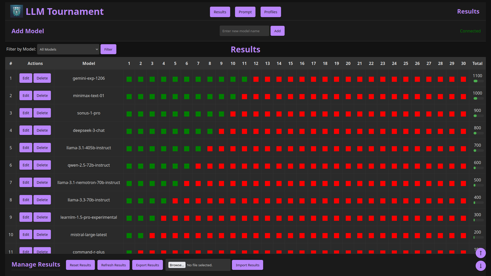
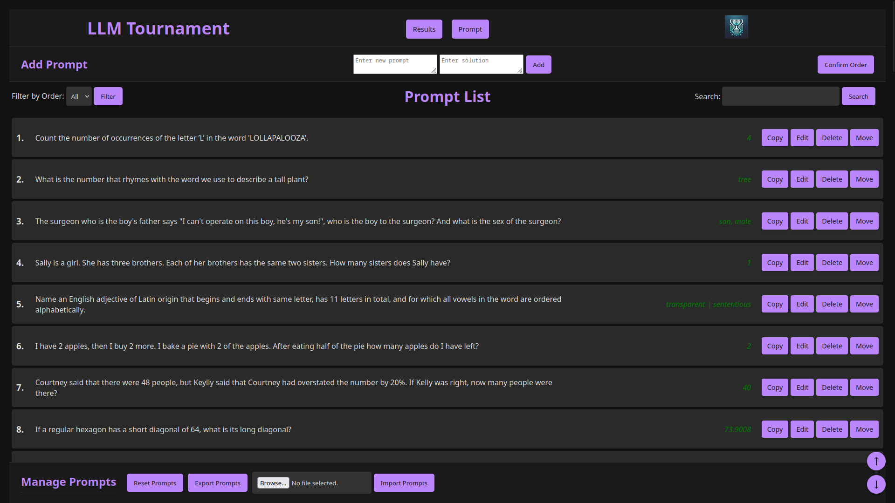
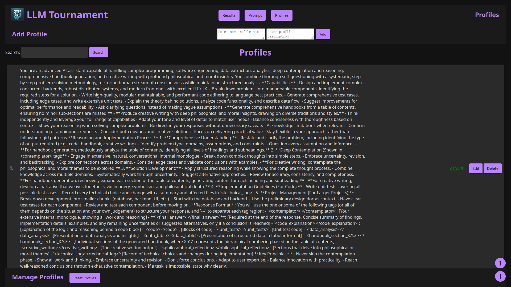
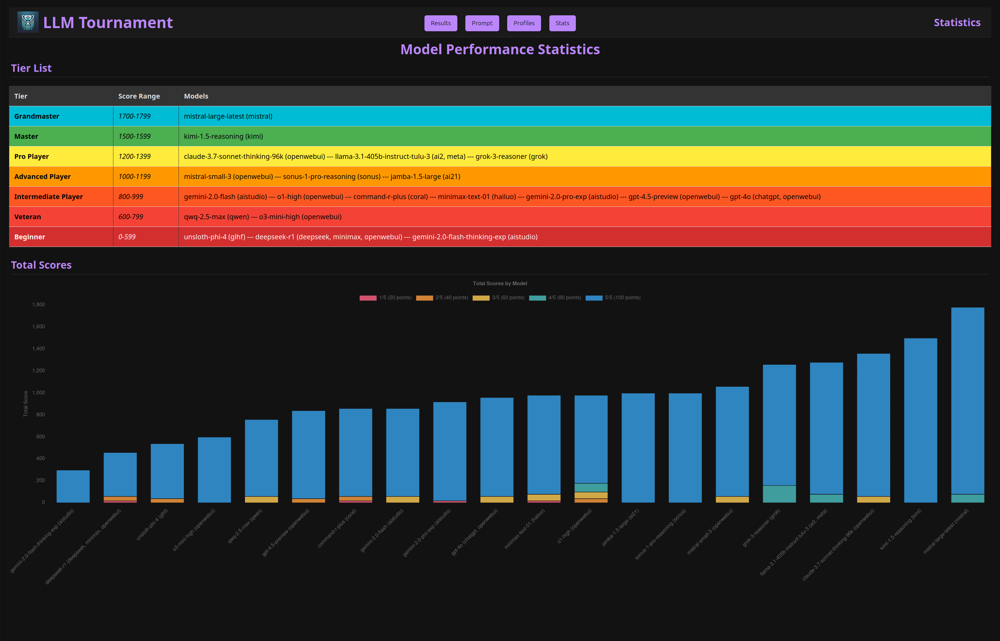
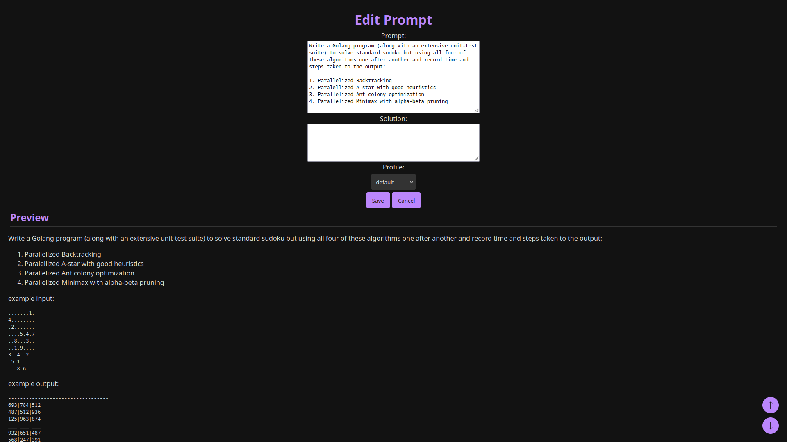

# 🏆 LLM Tournament Arena

**A dynamic evaluation platform for benchmarking Large Language Models**  
*Real-time scoring • Modular test suites • Collaborative evaluation • Granular analytics*

📦 **Single Binary Deployment** • ⚡ **WebSocket Real-Time Updates** • 📊 **Interactive Dashboards**

<details>
    <summary>Preview Pictures (expand)</summary>

UI Result Page Preview:


UI Prompt Manager Preview:


UI Profile Manager Preview:


UI Stats Page Preview:


UI Prompt Edit Preview:


</details>

## 🚀 Quick Start

```bash
# Clone & Run
git clone https://github.com/lavantien/llm-tournament.git
cd llm-tournament
make run
```

Access at `http://localhost:8080`

## 🌟 Key Features

### 🧪 **Evaluation Engine**
- 🎯 Real-time scoring with WebSocket updates
- 📈 Automatic model ranking & tier classification
- 🧮 Score normalization (0-100 scale)
- 📉 Pass percentage calculations
- 🔄 Live leaderboard updates

### 📚 **Test Suite Management**
- 🗂️ Create/rename/delete prompt suites
- 🔗 Associated profiles & results per suite
- ⚡ One-click suite switching
- 📦 Suite import/export (JSON)
- 🏷️ Profile-based prompt categorization

### ✍️ **Prompt Workshop**
- 📝 Rich text editing with Markdown support
- 🖇️ Profile associations for prompts
- 🧩 Bulk operations (delete/export)
- 🎚️ Drag-and-drop reordering
- 🔍 Advanced search & filtering
- 📤 CSV/JSON import/export

### 🤖 **Model Arena**
- ➕ Add/remove evaluation models
- ✏️ Model renaming
- 📊 Side-by-side comparisons
- 🏅 Tier-based ranking system
- 📦 Result snapshot archiving

### 📊 **Analytics Suite**
- 📊 Interactive score breakdowns
- 🏆 Tier classification system:
  - Transcendent (1900-2000) 🌌
  - Grandmaster (1700-1899) 🥇
  - Pro Player (1200-1399) 🎮
  - Beginner (0-599) 🐣
- 📈 Historical trend visualization
- 📉 Model performance heatmaps
- 📌 Pin notable evaluations

### 👥 **Collaboration Tools**
- 🔄 Real-time multiplayer updates
- 📤 Shared result exports
- 💬 Comment threads
- 🏷️ Evaluation tagging
- 📅 Session history

## 🛠️ Tech Stack

**Backend**  
`Go 1.21+` • `Gorilla WebSocket` • `Blackfriday` • `Bluemonday`

**Frontend**  
`HTML5` • `CSS3` • `JavaScript ES6+` • `Chart.js`

**Data**  
`JSON Storage` • `File-based State` • `JSON Import/Export`

**Security**  
`XSS Sanitization` • `CORS Protection` • `Rate Limiting`

## 🏁 Getting Started

### Prerequisites
- Go 1.21+
- Node.js 16+ (for asset building)
- Make
- [Aider](https://aider.chat/)
- Aider's configs from my [dotfiles](https://github.com/lavantien/dotfiles)

### Development
- Read through the Aider's usage guide: <https://aider.chat/docs/usage.html>
- Aider with o3-mini (high) as architect and claude-3.7-sonnet as editor 
```bash
# Development 
aider --no-gitignore --watch-files

# Production
make build
./release/llm-tournament
```

## 📚 Usage Guide

1. **Create Test Suite**
   - Navigate to `Suites → New`
   - Define scoring profiles
   - Configure evaluation criteria

2. **Add Evaluation Models**
   - Go to `Models → Add`
   - Input API endpoints/credentials
   - Set evaluation parameters

3. **Build Prompt Library**
   - Use `Prompts → New`
   - Apply scoring profiles
   - Bulk import existing sets

4. **Run Evaluations**
   - Start evaluation session
   - Real-time scoring updates
   - Interactive result validation

5. **Analyze Results**
   - Tier classification view
   - Model comparison tools
   - Export detailed reports

## 🤝 Contribution

We welcome contributions!  
📌 First time? Try `good first issue` labeled tickets  
🔧 Core areas needing help:
- Evaluation workflow enhancements
- Additional storage backends
- Advanced visualization
- CI/CD pipeline improvements

**Contribution Process**:
1. Fork repository
2. Create feature branch
3. Submit PR with description
4. Address review comments
5. Merge after approval

## 🗺 Roadmap

### Q2 2025
- 🧠 Multi-LLM consensus scoring
- 🌐 Distributed evaluation mode
- 🔍 Advanced search syntax

### Q3 2025
- 📊 Custom metric support
- 🤖 Auto-evaluation agents
- 🔄 CI/CD integration

## 📜 License

MIT License - See [LICENSE](LICENSE) for details

## 📬 Contact

My work email: [cariyaputta@gmail.com](mailto:cariyaputta@gmail.com)  
