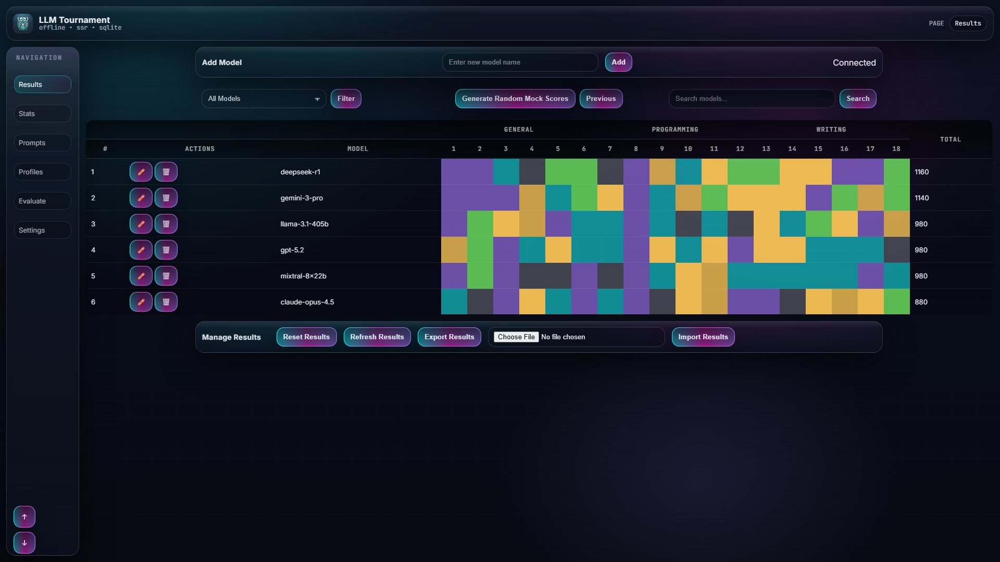
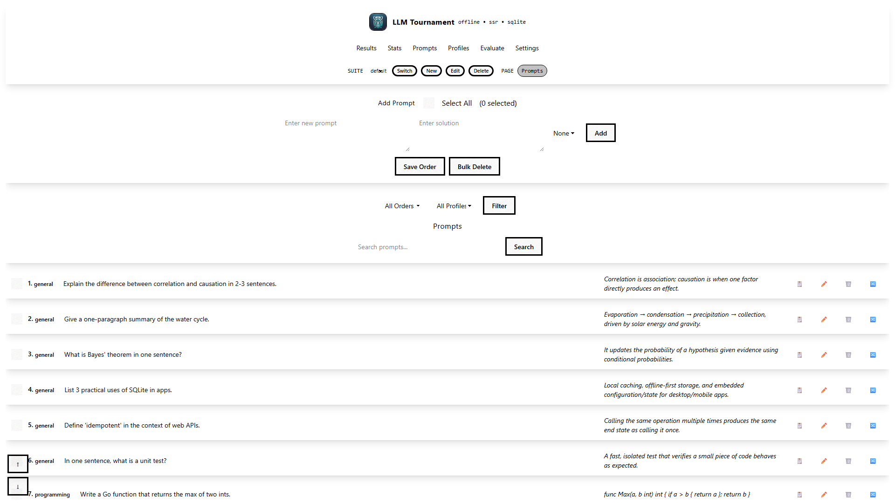
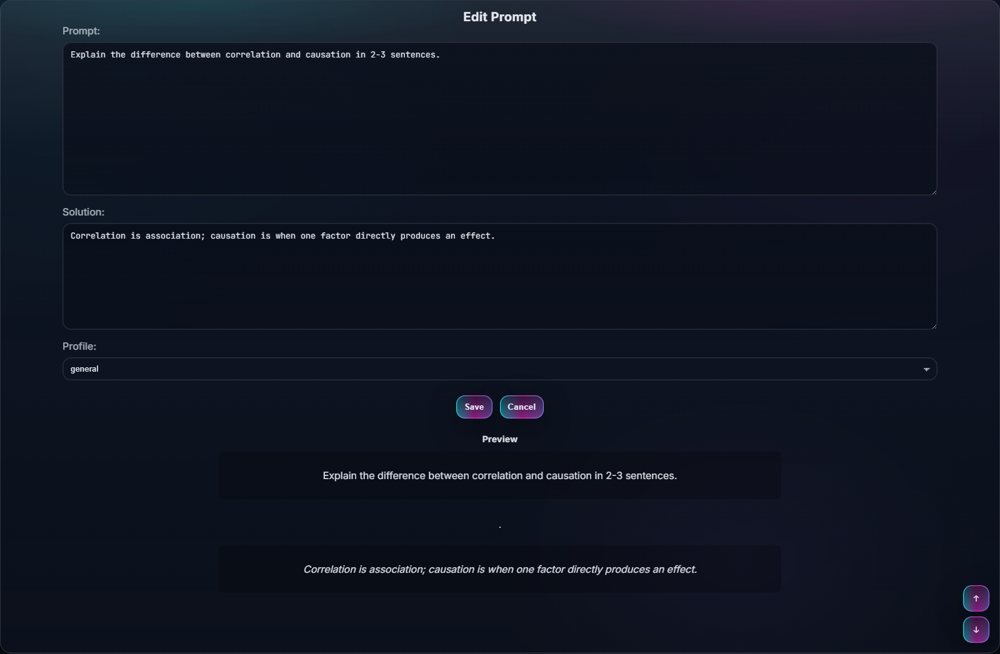
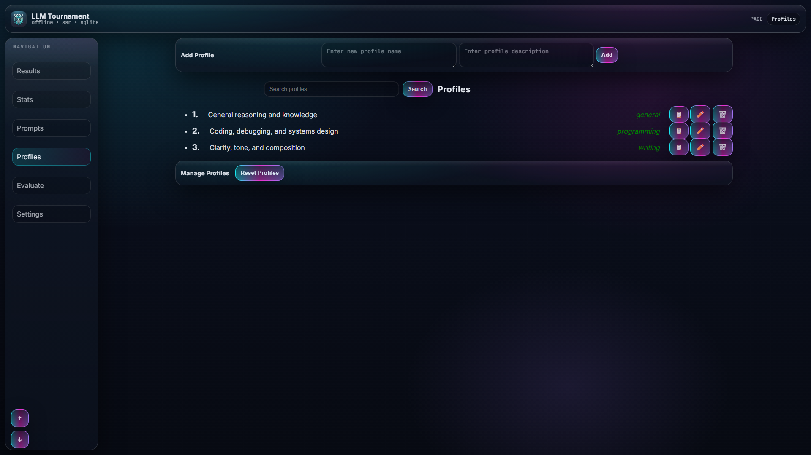
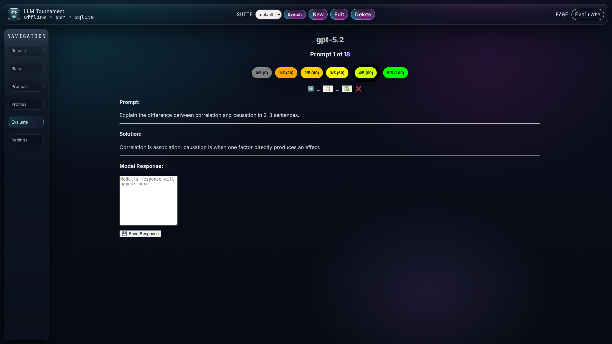
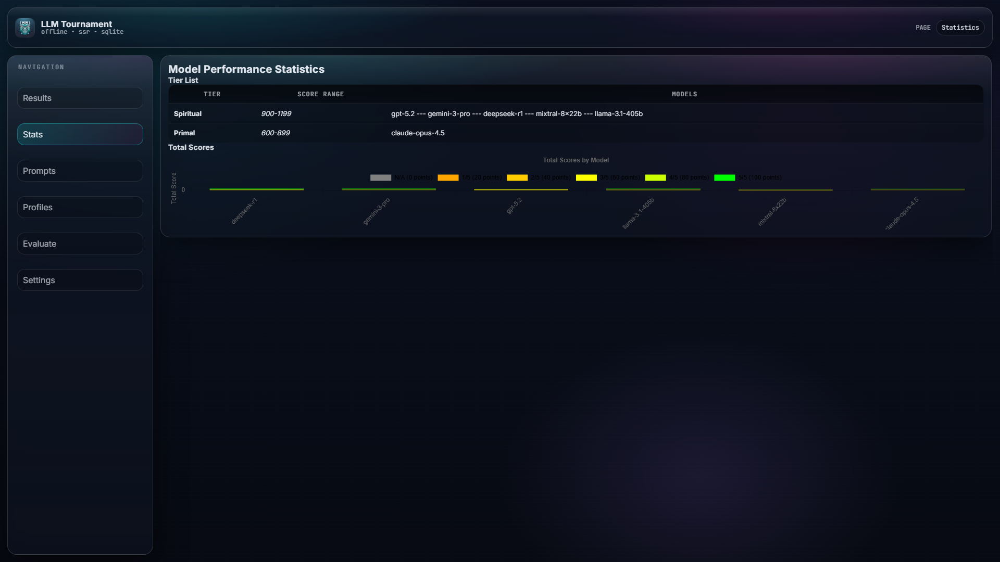
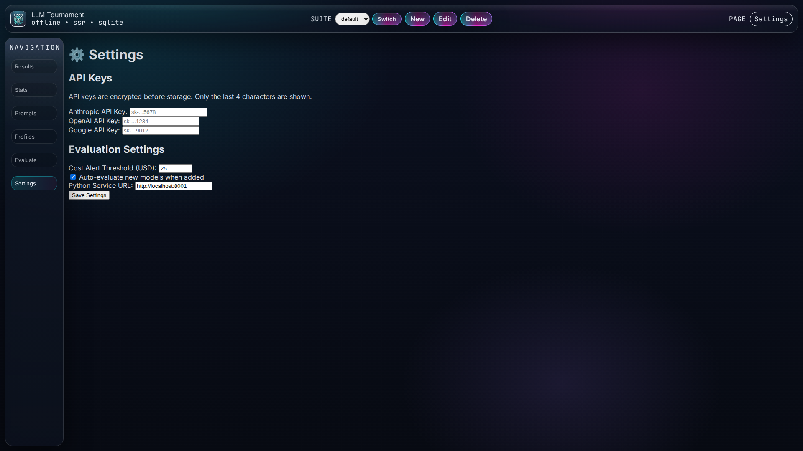
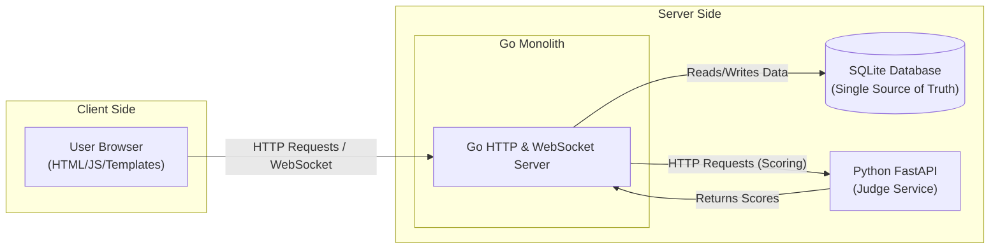
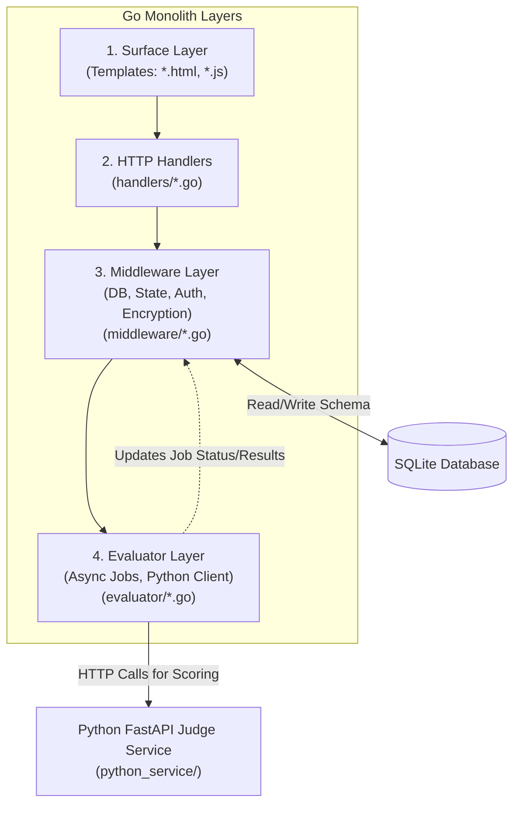

# LLM Tournament Arena

[](./coverage.html)
[](https://github.com/lavantien/llm-tournament/actions)
[](https://go.dev/)
[](https://python.org/)
[](https://sqlite.org/)
[](LICENSE)

A local-first benchmarking arena for evaluating and comparing Large Language Models (LLMs) with both manual scoring and optional automated evaluation.

**Highlights**
- SQLite-backed, single-binary Go server with SSR templates + WebSockets (`:8080`)
- Prompt suites, profiles, models, results grid, and analytics
- Optional Python FastAPI "judge service" for automated evaluation (`:8001`)
- Encrypted API key storage (AES-256-GCM) via `ENCRYPTION_KEY`

**UI Stack**
- Tailwind CSS v4.1.18 + DaisyUI v5.0.0 (0% custom CSS)
- Built-in DaisyUI components and themes (cyberpunk)
- Industry-standard utility-first styling approach
- Zero maintenance custom CSS codebase

## Table of Contents

- [Quick Start](#quick-start)
- [UI Design](#ui-design)
- [Features](#features)
- [Architecture](#architecture)
- [Tech Stack](#tech-stack)
- [Installation](#installation)
- [Testing](#testing)
- [Troubleshooting](#troubleshooting)
- [API Reference](#api-reference)
- [Project Structure](#project-structure)
- [Environment Variables](#environment-variables)
- [Documentation Guidelines](#documentation-guidelines)
- [License](#license)

## UI Design

**Updated: Tailwind v4 + DaisyUI v5 (Zero Custom CSS)**

The UI has been migrated to use **100% pure Tailwind v4 + DaisyUI v5** components. See [DESIGN_CONCEPT.md](DESIGN_CONCEPT.md) for complete design specifications and [DESIGN_ROLLOUT.md](DESIGN_ROLLOUT.md) for detailed migration plan.

**Key Design Decisions:**
- Zero custom CSS - all styling uses Tailwind utilities or DaisyUI semantic components
- Built-in DaisyUI `cyberpunk` theme provides dark backgrounds with neon accents
- Tailwind v4 built-in animations (`animate-spin`, `animate-ping`, `animate-pulse`) replace custom keyframes
- Dynamic score theming uses Tailwind arbitrary values (`bg-[#color]`) instead of CSS variables
- Glass panels use DaisyUI `.card` components without custom glow effects
- Industry-standard approach using well-maintained tools (Tailwind + DaisyUI)

**Trade-offs:**
- No glass glow overlay effects (cleaner appearance)
- No grid overlay texture (cleaner background)
- Simpler animations (less dramatic, more performant)
- Standard DaisyUI components instead of custom semantic classes

## Quick Start

```bash
git clone https://github.com/lavantien/llm-tournament.git
cd llm-tournament
make run
```

Open http://localhost:8080 (data is stored in `data/tournament.db` by default).

No `make`? Run directly:

```bash
CGO_ENABLED=1 go run .
```

PowerShell:

```powershell
$env:CGO_ENABLED=1; go run .
```

## Docs

- UI design and migration: [DESIGN_CONCEPT.md](DESIGN_CONCEPT.md), [DESIGN_ROLLOUT.md](DESIGN_ROLLOUT.md)
- Automated evaluation setup: [AUTOMATED_EVALUATION_SETUP.md](AUTOMATED_EVALUATION_SETUP.md)
- Changelog / release notes: [CHANGELOG.md](CHANGELOG.md), [RELEASE_NOTES_v3.4.md](RELEASE_NOTES_v3.4.md)

## UI Tour

Screenshots are auto-generated from a seeded demo database (Playwright + headless Chromium):

```bash
npm install
npm run screenshots:install
npm run screenshots
```

### Results (Arena Grid)



### Prompts (List + Editor)



### Edit Prompt (Markdown + Metadata)



### Profiles



### Evaluate (Manual Scoring)



### Stats (Analytics)



### Settings (Encrypted Keys + Automation)



## Features

### Automated Evaluation
- Multi-judge consensus scoring using Claude Opus 4.5, GPT-5.2, and Gemini 3 Pro with extended thinking
- Dual evaluation modes: objective (semantic matching) and creative (quality assessment)
- Async job queue with 3 concurrent workers and job persistence
- Real-time progress tracking and cost management (provider pricing varies)
- AES-256-GCM encrypted API key storage
- Complete audit trail with judge reasoning and confidence scores

### Manual Evaluation
- Real-time scoring on 0-100 scale (increments: 0, 20, 40, 60, 80, 100)
- Automatic model ranking with live leaderboard updates
- WebSocket-based instant updates across all clients
- State backup and rollback support
- Drag-and-drop prompt reordering and bulk operations

### Suite Management
- Independent prompt suites with isolated profiles, prompts, and results
- JSON import/export for suites and evaluation results
- Duplicate cleanup and SQLite migration support
- One-click suite switching

### Analytics
- 12-tier classification system: Transcendental (≥3780) to Primordial (<300)
- Interactive visualizations using Chart.js
- Score distributions and tier-based model grouping
- Performance comparisons across models and prompt types

### Interface
- Markdown editor with live preview
- Advanced search and filtering
- Copy-to-clipboard functionality
- Connection status monitoring with automatic reconnection

## Architecture

```
Go Server (:8080)              Python Service (:8001)
├── HTTP Handlers              ├── AI Judge Service
├── WebSocket Hub    ──HTTP──→ ├── 3 LLM Judges
├── Job Queue                  └── Consensus Scoring
└── SQLite DB
```

**High-Level System Context**


**Layered Architecture Flow**


Request Flow: User → Handlers → Middleware → SQLite → WebSocket Broadcast
Evaluation Flow: Job Queue → Python Service → AI Judges → Consensus → Score Update

### Bird's-Eye View

* This is a Go monolith (HTTP + WebSocket) with SQLite as a single source of truth, plus an optional Python FastAPI "judge service" for automated scoring.
* The repo is organized by "layer": surface (templates) → HTTP handlers → middleware (DB/state/render/ws/encryption) → evaluator (async jobs + Python client) → `python_service` (judge logic).
* The fastest "index" is to URL handler map in `main.go:60`, and the DB schema is centralized in `middleware/database.go:58`.
* **UI Migration**: All styling now uses Tailwind v4 + DaisyUI v5 components with zero custom CSS. See [DESIGN_ROLLOUT.md](DESIGN_ROLLOUT.md) for complete migration details.

### Where To Look In 5 Seconds

* **HTTP routes / feature entrypoint:** `main.go:60` (every user-visible feature starts as a path here).
* **HTML/JS for a page:** `templates/*.html` and `templates/*.js` (e.g. `templates/results.html`, `templates/prompt_list.html`).
* **DB tables & relationships:** `middleware/database.go:58` (schema includes `suites`, `profiles`, `prompts`, `models`, `scores`, `settings`, `evaluation_jobs`, `evaluation_history`, etc.).
* **Per-feature server logic:** `handlers/*.go` (files are feature-named: prompts/models/profiles/results/stats/settings/suites/evaluation).
* **WebSocket messages:** `middleware/socket.go:33` (server-side `/ws`, broadcasting and client tracking).
* **Automated evaluation pipeline:** `handlers/evaluation.go:25` `evaluator/job_queue.go:11` (workers/jobs) `evaluator/litellm_client.go:12` (HTTP to Python) `python_service/main.py:87` (FastAPI endpoints).
* **UI Components:** Tailwind v4 + DaisyUI v5. See [DESIGN_CONCEPT.md](DESIGN_CONCEPT.md) for complete component mapping.
* **Test-as-documentation:** `handlers/*_test.go`, `middleware/*_test.go`, `evaluator/*_test.go`, `integration/prompts_integration_test.go`.

### Common Feature Map

* **Prompt suites:** `main.go:76` `handlers/suites.go` (+ UI in `templates/*prompt_suite*.html`)
* **Prompts CRUD/order:** `main.go:62`/`main.go:66`/`main.go:73` `handlers/prompt.go:1` (+ reorder over WS in `middleware/socket.go:71`)
* **Models CRUD:** `main.go:63` `handlers/models.go`
* **Manual scoring/results UI:** `main.go:80`/`main.go:81` `handlers/results.go` (+ `templates/results.html`)
* **Stats/analytics:** `main.go:93` `handlers/stats.go` (+ `templates/stats.html`)
* **Settings + encrypted keys:** `main.go:95` `handlers/settings.go` (+ crypto in `middleware/encryption.go:13`)
* **Automated evaluation:** `main.go:98` `handlers/evaluation.go:25` (jobs stored in `evaluation_jobs` in `middleware/database.go:115`)

### Search Cheats (copy/paste)

* Find a feature by URL: `rg -n '"/evaluate/all"|"/results"|"/settings"' main.go`
* Find which handler renders a template: `rg -n "results\\.html|prompt_list\\.html" handlers`
* Find everything touching a table: `rg -n "evaluation_jobs|evaluation_history|model_responses" -S .`
* Find a websocket message type: `rg -n "update_prompts_order|results" middleware/templates -S`

## Tech Stack

Backend: Go 1.24+, Gorilla WebSocket, Blackfriday, Bluemonday, SQLite, AES-256-GCM

AI Service: Python 3.8+, FastAPI, LiteLLM, Anthropic/OpenAI/Google SDKs

Frontend: HTML5, Tailwind CSS v4.1.18, DaisyUI v5.0.0, JavaScript ES6+, Chart.js 4.x, Marked.js

Security: XSS sanitization, CORS protection, input validation, encrypted API keys

## Installation

### Prerequisites

- Go 1.24+
- Python 3.8+ (for automated evaluation)
- A C toolchain for CGO/SQLite (e.g., gcc/clang; on Windows install MinGW-w64/MSYS2)
- Git
- Make (optional, for convenience targets)
- Node.js and npm (for UI screenshots only)

### Manual Evaluation (Go-only)

```bash
# Run from source
make run

# Or without make
CGO_ENABLED=1 go run .
```

Build a binary:

```bash
make build
```

Run it:

- Linux/macOS: `./release/llm-tournament`
- Windows (PowerShell): `.\release\llm-tournament.exe`

One-time migration (only if upgrading old result formats):

```bash
CGO_ENABLED=1 go run . --migrate-results
```

### Automated Evaluation (Go + Python)

Install Python dependencies:

```bash
cd python_service
pip install -r requirements.txt
```

Generate and export `ENCRYPTION_KEY` (64 hex chars / 32 bytes):

```bash
export ENCRYPTION_KEY=$(openssl rand -hex 32)
```

PowerShell:

```powershell
$env:ENCRYPTION_KEY = (python -c "import secrets; print(secrets.token_hex(32))")
```

Start Python service (terminal 1):

```bash
python main.py  # Port 8001
```

Start Go server (terminal 2):

```bash
cd ..
CGO_ENABLED=1 go run .  # Port 8080
```

Configure API keys at http://localhost:8080/settings

Complete setup guide: [AUTOMATED_EVALUATION_SETUP.md](AUTOMATED_EVALUATION_SETUP.md)

### UI Installation (DaisyUI + Tailwind v4)

The UI now uses Tailwind CSS v4 + DaisyUI v5 with zero custom CSS. See [DESIGN_CONCEPT.md](DESIGN_CONCEPT.md) and [DESIGN_ROLLOUT.md](DESIGN_ROLLOUT.md) for complete migration details.

**Install dependencies:**

```bash
npm install
```

This installs:
- Tailwind CSS v4.1.18
- DaisyUI v5.0.0
- PostCSS and build tools

**Build CSS:**

```bash
npm run build:css
```

This generates `templates/output.css` from `templates/input.css` using PostCSS.

## Testing

```bash
# Run all tests with TDD-guard, race detection, and coverage
# (requires `tdd-guard-go` on your PATH)
make test

# Run tests with verbose output (bypasses TDD-guard)
make test-verbose

# Manual test run
CGO_ENABLED=1 go test ./... -v -race -cover

# Test Python service health
curl http://localhost:8001/health
```

### Testing Methodology (UI Components)

**Important**: Tailwind/DaisyUI classes are strings in your templates—no runtime JS needed for unit tests. You verify classes are present in rendered HTML without applying actual CSS.

**Go SSR Testing**: Full SSR flow verification using `cmp` package (now part of Go standard lib). Test handlers execute templates with data and verify DaisyUI classes are present in output.

**httptest Integration**: HTTP handler testing with rendered HTML output. Verify template rendering with real data structures.

**Visual Regression**: Use existing screenshot system to compare before/after UI states.

### Coverage

Package-level statement coverage from `CGO_ENABLED=1 go test ./... -coverprofile coverage.out`:

| Package | Coverage |
| --- | ---: |
| llm-tournament | 100.0% |
| llm-tournament/evaluator | 100.0% |
| llm-tournament/handlers | 98.8% |
| llm-tournament/integration | - |
| llm-tournament/middleware | 100.0% |
| llm-tournament/templates | 100.0% |
| llm-tournament/testutil | 99.6% |
| llm-tournament/tools/screenshots/cmd/demo-server | 100.0% |
| **Total** | **99.8%** |


## Troubleshooting

- `CGO_ENABLED=1` set but build fails: install a working C compiler toolchain (CGO required it for SQLite).
- `ENCRYPTION_KEY` environment variable not set: set `ENCRYPTION_KEY` before using encrypted API keys / automated evaluation.
- Automated evaluation stuck/unavailable: confirm that Python service is running and healthy (`GET /health` on `:8001`).
- Port already in use: stop conflicting process or run on different ports (Python: `PORT`; Go server currently listens on `:8080` in `main.go`).
- DB issues: default DB is `data/tournament.db`; you can point to another file with `--db <path>`.
- **DaisyUI classes not rendering**: Verify `tailwind.config.js` includes DaisyUI plugin and `npm run build:css` has been run.

## API Reference

### Evaluation Endpoints

- POST /evaluate/all - Evaluate all models × all prompts
- POST /evaluate/model?id={id} - Evaluate one model × all prompts
- POST /evaluate/prompt?id={id} - Evaluate all models × one prompt
- GET /evaluation/progress?id={job_id} - Get job status
- POST /evaluation/cancel?id={job_id} - Cancel running job

### Settings Endpoints

- GET /settings - Settings page
- POST /settings/update - Update settings
- POST /settings/test_key - Test API key validity

### Core Endpoints

- GET /prompts - Prompts list (default route)
- GET /results - Results and scoring
- GET /profiles - Profile management
- WS /ws - WebSocket connection

## Project Structure

```
llm-tournament/
├── main.go              # Entry point, routing, server setup
├── handlers/            # HTTP handlers (models, prompts, results, stats, evaluation, settings)
├── middleware/          # Business logic (database, WebSocket, encryption, state)
├── evaluator/           # Async job queue, LLM client, consensus algorithm
├── python_service/      # FastAPI AI judge service (3 LLM judges)
├── templates/           # HTML, CSS, JavaScript
├── assets/              # UI screenshots and static images
├── data/                # SQLite database
├── tailwind.config.js    # Tailwind v4 + DaisyUI v5 configuration
└── postcss.config.js    # PostCSS configuration
```

**UI-Specific:**
- `templates/input.css` - Tailwind + DaisyUI imports only (zero custom CSS)
- `templates/output.css` - Generated CSS file (PostCSS output)
- `templates/*.html` - All HTML templates using DaisyUI components

## Environment Variables

- CGO_ENABLED=1 (required for SQLite)
- ENCRYPTION_KEY (64-char hex / 32 bytes; required for encrypted API key storage and automated evaluation)

Python judge service (optional):
- HOST (default `0.0.0.0`)
- PORT (default `8001`)

Generate encryption key:

- `openssl rand -hex 32`
- `python -c "import secrets; print(secrets.token_hex(32))"`

See [AUTOMATED_EVALUATION_SETUP.md](AUTOMATED_EVALUATION_SETUP.md) for detailed configuration.

## Documentation Guidelines

When editing documentation files, be aware that several files are automatically validated by tests and CI scripts. See [DOCUMENTATION_ENFORCEMENT.md](DOCUMENTATION_ENFORCEMENT.md) for:

- List of enforced documentation files (README.md, DESIGN_CONCEPT.md, design_preview.html)
- Required sections and formats for each file
- How to update documentation without breaking automation
- Troubleshooting common mistakes

**Quick reference:**
- `README.md` - Coverage table enforced by `scripts/update_coverage_table.py`
- `DESIGN_CONCEPT.md` - Section headers enforced by `design_preview_test.go`
- `design_preview.html` - Required elements enforced by `design_preview_test.go`

**Pre-commit hook (recommended):**
```bash
# Install automatic documentation verification before commits
cp scripts/pre-commit .git/hooks/pre-commit && chmod +x .git/hooks/pre-commit
```

This will automatically run `make verify-docs` when you commit documentation changes.

**To verify documentation changes:**
```bash
# Run specific enforcement test
CGO_ENABLED=1 go test -run TestDesignConceptAndPreview_ExistAndStructured -v

# Update coverage table after editing README
make update-coverage-table

# Run full test suite
make test
```

## License

MIT License - See [LICENSE](LICENSE) for details

## Contact

cariyaputta@gmail.com
