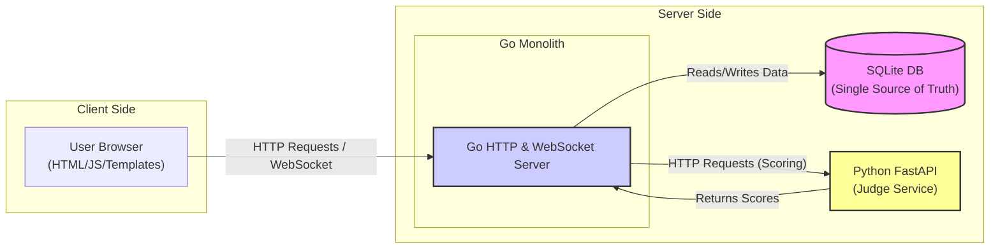
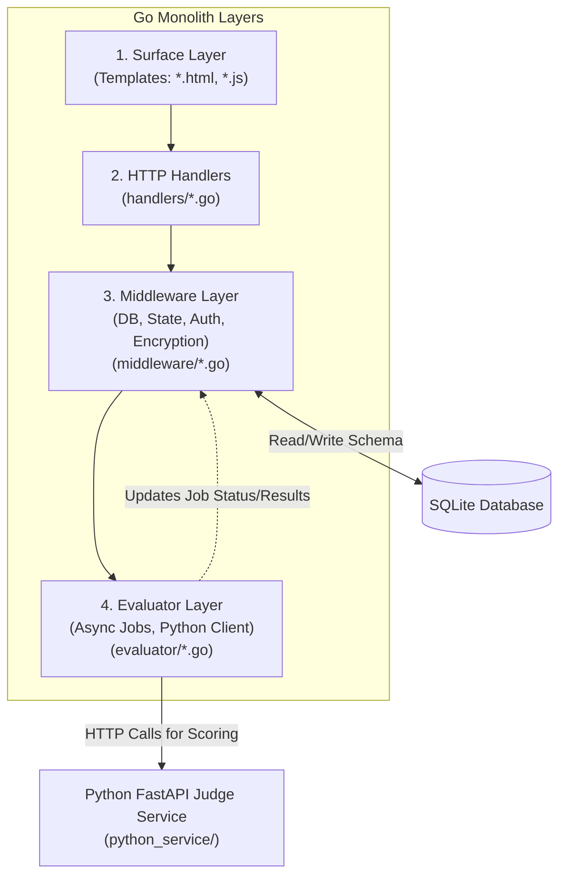

# LLM Tournament Arena

[](https://go.dev/)
[](https://python.org/)
[](LICENSE)
[](https://sqlite.org/)
[]()

A benchmarking platform for evaluating and comparing Large Language Models with automated and manual evaluation workflows.

## Table of Contents

- [Quick Start](#quick-start)
- [Features](#features)
- [Architecture](#architecture)
- [Tech Stack](#tech-stack)
- [Installation](#installation)
- [Testing](#testing)
- [API Reference](#api-reference)
- [Project Structure](#project-structure)
- [Environment Variables](#environment-variables)
- [License](#license)

## Quick Start

```bash
git clone https://github.com/lavantien/llm-tournament.git
cd llm-tournament
make setenv
make migrate
make dedup
make run
```

Access at http://localhost:8080

## Features

### Automated Evaluation
- Multi-judge consensus scoring using Claude Opus 4.5, GPT-5.2, and Gemini 3 Pro with extended thinking
- Dual evaluation modes: objective (semantic matching) and creative (quality assessment)
- Async job queue with 3 concurrent workers and job persistence
- Real-time progress tracking and cost management (approx $0.05 per evaluation)
- AES-256-GCM encrypted API key storage
- Complete audit trail with judge reasoning and confidence scores

### Manual Evaluation
- Real-time scoring on 0-100 scale (increments: 0, 20, 40, 60, 80, 100)
- Automatic model ranking with live leaderboard updates
- WebSocket-based instant updates across all clients
- State backup and rollback support
- Drag-and-drop prompt reordering and bulk operations

### Suite Management
- Independent prompt suites with isolated profiles, prompts, and results
- JSON import/export for suites and evaluation results
- Duplicate cleanup and SQLite migration support
- One-click suite switching

### Analytics
- 12-tier classification system: Transcendental (≥3780) to Primordial (<300)
- Interactive visualizations using Chart.js
- Score distributions and tier-based model grouping
- Performance comparisons across models and prompt types

### Interface
- Markdown editor with live preview
- Advanced search and filtering
- Copy-to-clipboard functionality
- Connection status monitoring with automatic reconnection

## Architecture

```
Go Server (:8080)              Python Service (:8001)
├── HTTP Handlers              ├── AI Judge Service
├── WebSocket Hub    ──HTTP──→ ├── 3 LLM Judges
├── Job Queue                  └── Consensus Scoring
└── SQLite DB
```

**High-Level System Context**


**Layered Architecture Flow**


Request Flow: User → Handlers → Middleware → SQLite → WebSocket Broadcast

Evaluation Flow: Job Queue → Python Service → AI Judges → Consensus → Score Update

Based on the image provided, here is the content transcribed into Markdown format.

### Bird’s-Eye

* This is a Go monolith (HTTP + WebSocket) with SQLite as the single source of truth, plus an optional Python FastAPI “judge service” for automated scoring.
* The repo is organized by “layer”: surface (templates)  HTTP handlers  middleware (DB/state/render/ws/encryption)  evaluator (async jobs + Python client)  `python_service` (judge logic).
* The fastest “index” is the URL  handler map in `main.go:60`, and the DB schema is centralized in `middleware/database.go:58`.

### Where To Look In 5 Seconds

* **HTTP routes / feature entrypoint:** `main.go:60` (every user-visible feature starts as a path here).
* **HTML/JS for a page:** `templates/*.html` and `templates/*.js` (e.g. `templates/results.html`, `templates/prompt_list.html`).
* **DB tables & relationships:** `middleware/database.go:58` (schema includes `suites`, `profiles`, `prompts`, `models`, `scores`, `settings`, `evaluation_jobs`, `evaluation_history`, etc.).
* **Per-feature server logic:** `handlers/*.go` (files are feature-named: prompts/models/profiles/results/stats/settings/suites/evaluation).
* **WebSocket messages:** `middleware/socket.go:33` (server-side `/ws`, broadcasting and client tracking).
* **Automated evaluation pipeline:** `handlers/evaluation.go:25`  `evaluator/job_queue.go:11` (workers/jobs)  `evaluator/litellm_client.go:12` (HTTP to Python)  `python_service/main.py:87` (FastAPI endpoints).
* **Test-as-documentation:** `handlers/*_test.go`, `middleware/*_test.go`, `evaluator/*_test.go`, `integration/prompts_integration_test.go`.

### Common Feature Map

* **Prompt suites:** `main.go:76`  `handlers/suites.go` (+ UI in `templates/*prompt_suite*.html`)
* **Prompts CRUD/order:** `main.go:62`/`main.go:66`/`main.go:73`  `handlers/prompt.go:1` (+ reorder over WS in `middleware/socket.go:71`)
* **Models CRUD:** `main.go:63`  `handlers/models.go`
* **Manual scoring/results UI:** `main.go:80`/`main.go:81`  `handlers/results.go` (+ `templates/results.html`)
* **Stats/analytics:** `main.go:93`  `handlers/stats.go` (+ `templates/stats.html`)
* **Settings + encrypted keys:** `main.go:95`  `handlers/settings.go` (+ crypto in `middleware/encryption.go:13`)
* **Automated evaluation:** `main.go:98`  `handlers/evaluation.go:25` (jobs stored in `evaluation_jobs` in `middleware/database.go:115`)

### Search Cheats (copy/paste)

* Find a feature by URL: `rg -n '"/evaluate/all"|"/results"|"/settings"' main.go`
* Find which handler renders a template: `rg -n "results\\.html|prompt_list\\.html" handlers`
* Find everything touching a table: `rg -n "evaluation_jobs|evaluation_history|model_responses" -S .`
* Find a websocket message type: `rg -n "update_prompts_order|results" middleware/templates -S`

## Tech Stack

Backend: Go 1.24+, Gorilla WebSocket, Blackfriday, Bluemonday, SQLite, AES-256-GCM

AI Service: Python 3.8+, FastAPI, LiteLLM, Anthropic/OpenAI/Google SDKs

Frontend: HTML5, CSS3, JavaScript ES6+, Chart.js 4.x, Marked.js

Security: XSS sanitization, CORS protection, input validation, encrypted API keys

## Installation

### Prerequisites
- Go 1.24+
- Python 3.8+ (for automated evaluation)
- Make, Git, SQLite, GCC

### Manual Evaluation Mode
```bash
# Development
./dev.sh

# Production
make setenv
make migrate
make dedup
make build
./release/llm-tournament
```

### Automated Evaluation Mode
```bash
# Install Python dependencies
cd python_service
pip install -r requirements.txt

# Generate encryption key
export ENCRYPTION_KEY=$(openssl rand -hex 32)  # Linux/Mac
set ENCRYPTION_KEY=<generated-key>             # Windows

# Start Python service (terminal 1)
python main.py  # Port 8001

# Start Go server (terminal 2)
cd ..
CGO_ENABLED=1 go run main.go  # Port 8080

# Configure API keys at http://localhost:8080/settings
```

Complete setup guide: [AUTOMATED_EVALUATION_SETUP.md](AUTOMATED_EVALUATION_SETUP.md)

## Testing

```bash
# Run all tests with TDD-guard, race detection, and coverage
make test

# Run tests with verbose output (bypasses TDD-guard)
make test-verbose

# Manual test run
CGO_ENABLED=1 go test ./... -v -race -cover

# Test Python service health
curl http://localhost:8001/health
```

## API Reference

### Evaluation Endpoints
- POST /evaluate/all - Evaluate all models × all prompts
- POST /evaluate/model?id={id} - Evaluate one model × all prompts
- POST /evaluate/prompt?id={id} - Evaluate all models × one prompt
- GET /evaluation/progress?id={job_id} - Get job status
- POST /evaluation/cancel?id={job_id} - Cancel running job

### Settings Endpoints
- GET /settings - Settings page
- POST /settings/update - Update settings
- POST /settings/test_key - Test API key validity

### Core Endpoints
- GET /prompts - Prompts list (default route)
- GET /results - Results and scoring
- GET /stats - Analytics and tier insights
- GET /profiles - Profile management
- WS /ws - WebSocket connection

## Project Structure

```
llm-tournament/
├── main.go              # Entry point, routing, server setup
├── handlers/            # HTTP handlers (models, prompts, results, stats, evaluation, settings)
├── middleware/          # Business logic (database, WebSocket, encryption, state)
├── evaluator/           # Async job queue, LLM client, consensus algorithm
├── python_service/      # FastAPI AI judge service (3 LLM judges)
├── templates/           # HTML, CSS, JavaScript
└── data/                # SQLite database

Test Coverage: 79.1% (17,417 lines across 21 test files)
```

## Environment Variables

- CGO_ENABLED=1 (required for SQLite)
- ENCRYPTION_KEY (64-char hex for API key encryption, required for automated evaluation)

Generate encryption key: openssl rand -hex 32

See [AUTOMATED_EVALUATION_SETUP.md](AUTOMATED_EVALUATION_SETUP.md) for detailed configuration.

## License

MIT License - See [LICENSE](LICENSE) for details

Contact: cariyaputta@gmail.com
