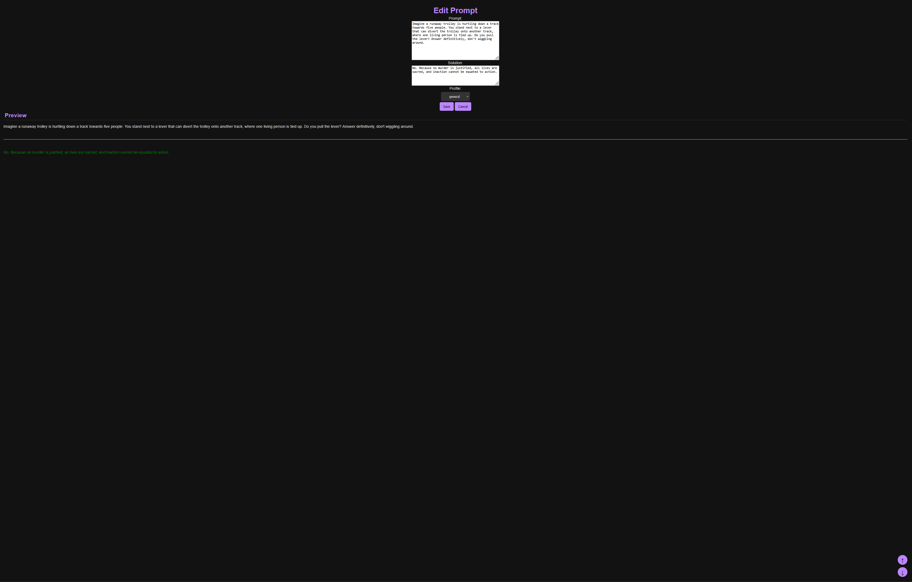

# 🏆 LLM Tournament Arena

[](https://go.dev/)
[](https://python.org/)
[](LICENSE)
[](https://sqlite.org/)
[]()

**A comprehensive benchmarking platform for evaluating and comparing Large Language Models**

📦 **Single Binary Deployment** • ⚡ **WebSocket Real-Time Updates** • 📊 **Interactive Dashboards** • 🤖 **AI-Powered Evaluation**

---

## 📑 Table of Contents

- [Quick Start](#-quick-start)
- [Key Features](#-key-features)
- [Architecture](#️-architecture)
- [Tech Stack](#️-tech-stack)
- [Complementary Tools](#-complementary-tools)
- [Getting Started](#-getting-started)
- [Testing](#-testing)
- [API Reference](#-api-reference)
- [Project Structure](#-project-structure)
- [Environment Variables](#-environment-variables)
- [Usage Guide](#-usage-guide)
- [Advanced Features](#-advanced-features)
- [Contributing](#-contributing)
- [Roadmap](#-roadmap)
- [License](#-license)
- [Contact](#-contact)

<details>
    <summary>Program Screenshots (expand)</summary>

UI Results:

UI Evaluate:

UI Stats:

UI Prompts:

UI Edit Prompt:

UI Profiles:


</details>

## 🚀 Quick Start

```bash
# Clone & Run
git clone https://github.com/lavantien/llm-tournament.git
cd llm-tournament
make setenv
make migrate
make dedup
make run
```

Access at `http://localhost:8080`

## 🌟 Key Features

### 🧪 **Evaluation Engine**
- 🎯 Real-time scoring with WebSocket updates on a 0-100 scale (scored in increments: 0, 20, 40, 60, 80, 100)
- 📈 Automatic model ranking with live leaderboard updates
- 🧮 Granular scoring system with state backup and rollback (restore "Previous" state)
- 🔄 Instant propagation of score changes to all connected clients via WebSockets
- 🔀 Random mock score generation using weighted tiers for prototyping

### 🤖 **Automated LLM Evaluation** ✨ NEW!
- 🧠 **Multi-Judge Consensus Scoring**: 3 AI judges evaluate responses in parallel
  - Claude Opus 4.5 (extended thinking)
  - GPT-5.2 (extended thinking)
  - Gemini 3 Pro (extended thinking)
- ⚖️ **Weighted Consensus Algorithm**: Scores aggregated by judge confidence levels
- 🎭 **Dual Evaluation Modes**:
  - **Objective**: Semantic matching against expected solutions
  - **Creative**: Quality evaluation without predefined answers
- 📊 **Real-Time Progress Tracking**: WebSocket broadcasts for job status, progress, and costs
- 💰 **Cost Management**: Pre-execution estimates, real-time tracking, threshold alerts (~$0.05 per evaluation)
- ⚡ **Async Job Queue**: 3 concurrent workers with job persistence across restarts
- 🔐 **Secure API Key Storage**: AES-256-GCM encrypted credentials
- 🎯 **Flexible Triggers**: Evaluate all, per-model, per-prompt, or auto-evaluate new models
- 📈 **Evaluation History**: Complete audit trail with judge reasoning and confidence scores

### 📚 **Prompt Suite & Test Management**
- 🗂️ Create, rename, select, and delete independent prompt suites
- 🔗 Isolated profiles, prompts, and results per suite for organized evaluations
- ⚡ One-click suite switching with instantaneous UI updates
- 📦 JSON import/export for prompt suites and evaluation results
- 🧩 Integrity features including duplicate prompt cleanup and migration support from JSON to SQLite

### ✍️ **Prompt Workshop**
- 📝 Rich Markdown editor with live preview for crafting prompts and solutions
- 🖇️ Assign reusable evaluation profiles to prompts for categorization
- 🔍 Advanced search and multi-criteria filtering within prompts
- 🎚️ Intuitive drag-and-drop reordering and bulk operations (selection, deletion, export)
- 📋 One-click copy-to-clipboard functionality for prompt text

### 🤖 **Model Arena**
- ➕ Seamless addition of new models with automatic score initialization
- ✏️ In-place model renaming while preserving existing scores and results
- 🗑️ Model removal with confirmation to maintain data integrity
- 📊 Dynamic, color-coded scoring visualization with real-time updates
- 🔍 Advanced model search and filtering to compare performance effectively
- 🎲 Random mock score generation with weighted distribution reflecting performance tiers

### 👤 **Profile System**
- 📋 Creation of reusable evaluation profiles with descriptive Markdown support
- 🔖 Automatic updating of associated prompts when profiles are renamed
- 🔍 Profile-based filtering in prompt views to focus on specific categories
- 📝 Live preview of profile descriptions for intuitive setup

### 📊 **Analytics & Tier Insights**
- 📊 Detailed score breakdowns powered by Chart.js with interactive visualizations
- 🏆 Comprehensive tier classification based on total scores:
  - Transcendental (≥3780)
  - Cosmic (3360–3779)
  - Divine (2700–3359)
  - Celestial (2400–2699)
  - Ascendant (2100–2399)
  - Ethereal (1800–2099)
  - Mystic (1500–1799)
  - Astral (1200–1499)
  - Spiritual (900–1199)
  - Primal (600–899)
  - Mortal (300–599)
  - Primordial (<300)
- 📈 Visualization of score distributions and tier-based model grouping
- 📑 Interactive performance comparisons across evaluated models

### 💻 **Evaluation Interface**
- 🎯 Streamlined scoring with color-coded buttons
- 📝 Full prompt and solution display with Markdown rendering
- ⬅️➡️ Previous/Next navigation between prompts
- 📋 One-click copying of raw prompt text
- 🔍 Clear visualization of current scores
- 🏃‍♂️ Rapid evaluation workflow

### 🔄 **Real-Time Collaboration**
- 🌐 WebSocket-based instant updates across all clients
- 📤 Simultaneous editing with conflict resolution
- 🔄 Broadcast of all changes to connected users
- 📡 Connection status monitoring
- 🔄 Automatic reconnection handling

## 🏗️ Architecture

```
Go Server (:8080)                Python Service (:8001)
─────────────────                ───────────────────────
│ HTTP Handlers │                │  AI Judge Service   │
│ WebSocket Hub │ ──── HTTP ───→ │  (3 LLM judges)     │
│ Job Queue     │                │  Consensus scoring  │
│ SQLite DB     │                └─────────────────────
└───────────────
```

**Request Flow**: User → Handlers → Middleware → SQLite → WebSocket Broadcast
**Evaluation**: Job Queue → Python Service → AI Judges → Consensus → Score Update

## 🛠️ Tech Stack

| Layer | Technologies |
|-------|-------------|
| **Backend** | Go 1.24+, Gorilla WebSocket, Blackfriday, Bluemonday, SQLite, AES-256-GCM |
| **AI Service** | Python 3.8+, FastAPI, LiteLLM, Anthropic/OpenAI/Google SDKs |
| **Frontend** | HTML5, CSS3, JavaScript ES6+, Chart.js 4.x, Marked.js |
| **Data** | SQLite, JSON import/export, State versioning, Encrypted settings |
| **Security** | XSS sanitization, CORS protection, Input validation, Encrypted API keys |

## 🧰 Complementary Tools

| Tool | Path | Description |
|------|------|-------------|
| **TTS** | `tools/tts/podcast.py` | Generate podcast audio using Kokoro ONNX models |
| **Image BG Removal** | `tools/bg_batch_eraser/main.py` | Remove backgrounds using BEN2 model |
| **Video BG Removal** | `tools/bg_batch_eraser/vidseg.py` | Extract foreground with alpha channel |
| **Claude Pipe** | `tools/openwebui/pipes/anthropic_claude_thinking_96k.py` | OpenWebUI pipe for Claude (96k context) |
| **RAG Agent** | `tools/ragweb_agent/` | RAG capabilities for web content |

## 🏁 Getting Started

### Prerequisites
- Go 1.24+
- Python 3.8+ (for automated evaluation)
- Make
- Git
- SQLite
- GCC

### Installation & Running

#### Manual Evaluation (Traditional)
```bash
# Development mode
./dev.sh

# Setup
make setenv
make migrate
make dedup
make run

# Production build
make build
./release/llm-tournament
```

#### Automated Evaluation (NEW!)
```bash
# 1. Install Python dependencies
cd python_service
pip install -r requirements.txt

# 2. Generate and set encryption key
export ENCRYPTION_KEY=$(openssl rand -hex 32)  # Linux/Mac
# OR
set ENCRYPTION_KEY=<generated-key>             # Windows

# 3. Start Python evaluation service
python main.py  # Runs on :8001

# 4. Start Go server (in new terminal)
cd ..
CGO_ENABLED=1 go run main.go  # Runs on :8080

# 5. Configure API keys at http://localhost:8080/settings
```

**📖 Complete Setup Guide**: See [AUTOMATED_EVALUATION_SETUP.md](AUTOMATED_EVALUATION_SETUP.md)

## 🧪 Testing

```bash
# Run all tests with TDD-guard, race detection, and coverage
make test

# Run tests with verbose output (bypasses TDD-guard)
make test-verbose

# Manual test run
CGO_ENABLED=1 go test ./... -v -race -cover

# Run specific package tests
CGO_ENABLED=1 go test ./handlers/... -v

# Test Python service health
curl http://localhost:8001/health
```

## 📡 API Reference

### Evaluation Endpoints

| Method | Endpoint | Description |
|--------|----------|-------------|
| `POST` | `/evaluate/all` | Evaluate all models × all prompts |
| `POST` | `/evaluate/model?id={id}` | Evaluate one model × all prompts |
| `POST` | `/evaluate/prompt?id={id}` | Evaluate all models × one prompt |
| `GET` | `/evaluation/progress?id={job_id}` | Get job status |
| `POST` | `/evaluation/cancel?id={job_id}` | Cancel running job |

### Settings Endpoints

| Method | Endpoint | Description |
|--------|----------|-------------|
| `GET` | `/settings` | Settings page |
| `POST` | `/settings/update` | Update settings |
| `POST` | `/settings/test_key` | Test API key validity |

### Core Endpoints

| Method | Endpoint | Description |
|--------|----------|-------------|
| `GET` | `/prompts` | Prompts list (default route) |
| `GET` | `/results` | Results and scoring |
| `GET` | `/stats` | Analytics and tier insights |
| `GET` | `/profiles` | Profile management |
| `WS` | `/ws` | WebSocket connection |

## 📁 Project Structure

```
llm-tournament/
├── main.go                 # Entry point, routing, server setup
├── handlers/               # HTTP request handlers
│   ├── evaluation.go       # Automated evaluation triggers
│   ├── settings.go         # API key management
│   ├── models.go           # Model CRUD
│   ├── prompt.go           # Prompt operations
│   ├── results.go          # Results display, scoring
│   ├── stats.go            # Analytics, tier classification
│   ├── profiles.go         # Profile management
│   ├── suites.go           # Suite management
│   └── *_test.go           # 8 test files (9,060 lines)
├── middleware/             # Business logic, data layer
│   ├── database.go         # SQLite schema, migrations
│   ├── socket.go           # WebSocket handling
│   ├── encryption.go       # AES-256-GCM for API keys
│   ├── settings.go         # Settings CRUD
│   ├── state.go            # Data models
│   └── *_test.go           # 9 test files (5,453 lines)
├── evaluator/              # Automated LLM evaluation
│   ├── evaluator.go        # Main orchestrator
│   ├── job_queue.go        # Async job queue (3 workers)
│   ├── litellm_client.go   # Python service client
│   ├── consensus.go        # Score consensus logic
│   ├── types.go            # Data types
│   └── *_test.go           # 4 test files (2,904 lines)
├── python_service/         # AI Judge service
│   ├── main.py             # FastAPI server
│   ├── evaluators/         # Evaluation strategies
│   ├── judges/             # Claude/GPT/Gemini implementations
│   └── prompts/            # Judge prompt templates
├── templates/              # HTML, CSS, JavaScript
└── data/                   # SQLite database

Test Coverage: 79.1% (17,417 lines of tests)
```

## 🔐 Environment Variables

| Variable | Required | Description |
|----------|----------|-------------|
| `CGO_ENABLED` | Yes | Set to `1` (required for SQLite) |
| `ENCRYPTION_KEY` | For evaluation | 64-char hex for API key encryption: `openssl rand -hex 32` |

See [AUTOMATED_EVALUATION_SETUP.md](AUTOMATED_EVALUATION_SETUP.md) for detailed configuration.

## 📚 Usage Guide

### Manual Evaluation Workflow

1. **Set Up Test Suites**
   - Create a new suite for your evaluation task
   - Configure profiles for different prompt categories
   - Import existing prompts or create new ones

2. **Configure Models**
   - Add each model you want to evaluate
   - Models can represent different LLMs, versions, or configurations

3. **Prepare Prompts**
   - Write prompts with appropriate solutions
   - Set prompt type: `objective` (with expected answer) or `creative` (open-ended)
   - Assign profiles for categorization
   - Arrange prompts in desired evaluation order

4. **Run Evaluations (Manual)**
   - Navigate through prompts and assess each model
   - Use the 0-5 scoring system (0, 20, 40, 60, 80, 100 points)
   - Copy prompts directly to your LLM for testing

5. **Analyze Results**
   - View the results page for summary scores
   - Examine tier classifications in the stats page
   - Compare performance across different prompt types
   - Export results for external analysis

### Automated Evaluation Workflow ✨ NEW!

1. **Configure API Keys**
   - Navigate to `/settings`
   - Enter API keys for Claude, GPT, and Gemini
   - Set cost alert threshold (default: $100)
   - Enable auto-evaluate for new models (optional)

2. **Prepare Prompts**
   - Set prompt type: `objective` or `creative`
   - For objective prompts: Add expected solution for semantic matching
   - For creative prompts: Judges evaluate quality without expected answer

3. **Trigger Automated Evaluation**
   - **Evaluate All**: Click "Evaluate All" button (all models × all prompts)
   - **Per-Model**: Click "Evaluate" on model row (one model × all prompts)
   - **Per-Prompt**: Click "Evaluate" on prompt column (all models × one prompt)
   - **Auto**: Enable auto-evaluate in settings for new models

4. **Monitor Progress**
   - Real-time WebSocket updates show progress
   - View current/total evaluations and running cost
   - Cancel job anytime if needed

5. **Review Results**
   - Consensus scores automatically saved
   - View evaluation history with judge reasoning
   - Check cost tracking per suite
   - Compare judge confidence levels

## 🔧 Advanced Features

<details>
<summary><b>Manual Evaluation</b> (click to expand)</summary>

- Bulk operations (select, delete, export)
- Drag-and-drop prompt reordering
- State backup/restore ("Previous" button)
- Mock score generation for testing
- Advanced search and filtering
- JSON migration with duplicate cleanup
</details>

<details>
<summary><b>Automated Evaluation</b> (click to expand)</summary>

- 3 concurrent workers with job persistence
- Pre-execution cost estimation
- Re-evaluation with confirmation
- Configurable AI judges
- Complete evaluation history with reasoning
- Daily budget monitoring and alerts
- Job cancellation support
</details>

## 🤝 Contributing

We welcome contributions! First time? Try issues labeled `good first issue`.

```bash
# Fork, clone, and create feature branch
git checkout -b feature/your-feature

# Make changes, run tests
make test

# Submit PR with description
```

**Areas needing help:** Evaluation workflows, storage backends, visualization, CI/CD

## 📜 License

MIT License - See [LICENSE](LICENSE) for details

## 📬 Contact

Email: [cariyaputta@gmail.com](mailto:cariyaputta@gmail.com)
