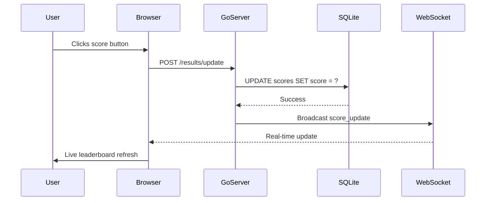
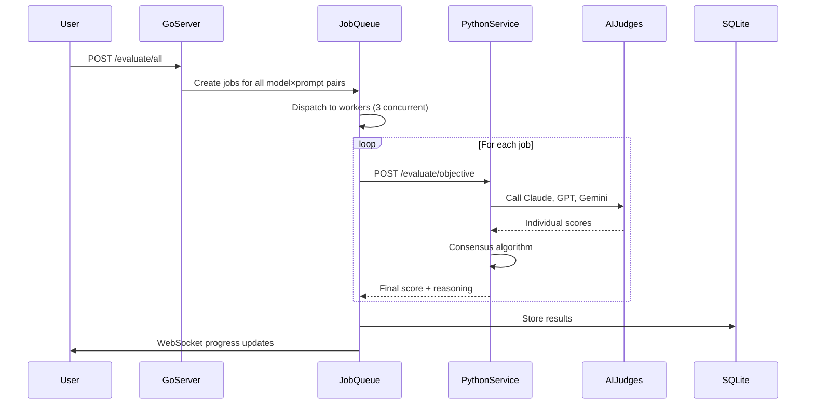
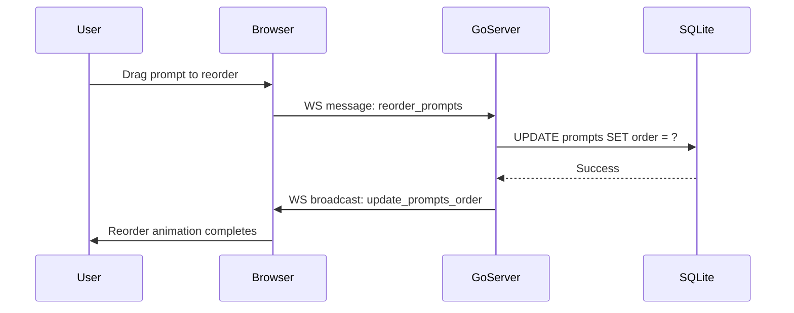
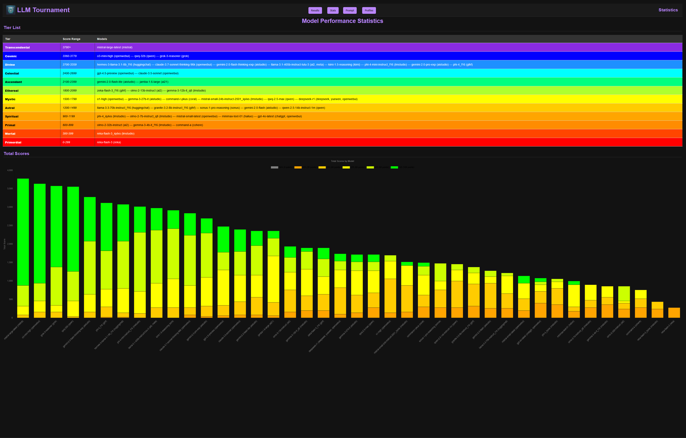

# LLM Tournament Arena

[](./coverage.html)
[](https://github.com/lavantien/llm-tournament/actions)
[](https://go.dev/)
[](https://python.org/)
[](https://sqlite.org/)
[](LICENSE)

A local-first benchmarking arena for evaluating and comparing Large Language Models (LLMs) with both manual scoring and optional automated evaluation.

**Highlights**

- SQLite-backed, single-binary Go server with SSR templates + WebSockets (`:8080`)
- Prompt suites, profiles, models, results grid, and analytics
- Optional Python FastAPI "judge service" for automated evaluation (`:8001`)
- Encrypted API key storage (AES-256-GCM) via `ENCRYPTION_KEY`

**UI Stack**

- Tailwind CSS v4.1.18 + DaisyUI v5.0.0 (0% custom CSS)
- Built-in DaisyUI components and themes (coffee)
- Industry-standard utility-first styling approach
- Zero maintenance custom CSS codebase

## Table of Contents

- [1. Quick Start](#1-quick-start)
- [2. UI Design](#2-ui-design)
- [3. Features](#3-features)
- [4. Architecture](#4-architecture)
- [5. Tech Stack](#5-tech-stack)
- [6. Installation](#6-installation)
- [7. Usage Tutorial](#7-usage-tutorial)
- [8. Development](#8-development)
- [9. Testing](#9-testing)
- [10. Troubleshooting](#10-troubleshooting)
- [11. API Reference](#11-api-reference)
- [12. Project Structure](#12-project-structure)
- [13. Environment Variables](#13-environment-variables)
- [14. Documentation Guidelines](#14-documentation-guidelines)
- [15. License](#15-license)
- [16. Contact](#16-contact)

## 1. Quick Start

```bash
git clone https://github.com/lavantien/llm-tournament.git
cd llm-tournament
make run
```

Open http://localhost:8080 (data is stored in `data/tournament.db` by default).

No `make`? Run directly:

```bash
CGO_ENABLED=1 go run .
```

PowerShell:

```powershell
$env:CGO_ENABLED=1; go run .
```

[↑ Back to top](#table-of-contents)

## 2. UI Design

**Updated: Tailwind v4 + DaisyUI v5 (Zero Custom CSS)**

The UI has been migrated to use **100% pure Tailwind v4 + DaisyUI v5** components. See [DESIGN_CONCEPT.md](DESIGN_CONCEPT.md) for complete design specifications and [DESIGN_ROLLOUT.md](DESIGN_ROLLOUT.md) for detailed migration plan.

**Key Design Decisions:**

- Zero custom CSS - all styling uses Tailwind utilities or DaisyUI semantic components
- Built-in DaisyUI `cyberpunk` theme provides dark backgrounds with neon accents
- Tailwind v4 built-in animations (`animate-spin`, `animate-ping`, `animate-pulse`) replace custom keyframes
- Dynamic score theming uses Tailwind arbitrary values (`bg-[#color]`) instead of CSS variables
- Glass panels use DaisyUI `.card` components without custom glow effects
- Industry-standard approach using well-maintained tools (Tailwind + DaisyUI)

**Trade-offs:**

- No glass glow overlay effects (cleaner appearance)
- No grid overlay texture (cleaner background)
- Simpler animations (less dramatic, more performant)
- Standard DaisyUI components instead of custom semantic classes

[↑ Back to top](#table-of-contents)

## 3. Features

### 3.1 Automated Evaluation

- Multi-judge consensus scoring using Claude Opus 4.5, GPT-5.2, and Gemini 3 Pro with extended thinking
- Dual evaluation modes: objective (semantic matching) and creative (quality assessment)
- Async job queue with 3 concurrent workers and job persistence
- Real-time progress tracking and cost management (provider pricing varies)
- AES-256-GCM encrypted API key storage
- Complete audit trail with judge reasoning and confidence scores

### 3.2 Manual Evaluation

- Real-time scoring on 0-100 scale (increments: 0, 20, 40, 60, 80, 100)
- Automatic model ranking with live leaderboard updates
- WebSocket-based instant updates across all clients
- State backup and rollback support
- Drag-and-drop prompt reordering and bulk operations

### 3.3 Suite Management

- Independent prompt suites with isolated profiles, prompts, and results
- JSON import/export for suites and evaluation results
- Duplicate cleanup and SQLite migration support
- One-click suite switching

### 3.4 Analytics

- 12-tier classification system: Transcendental (>=3780) to Primordial (<300)
- Interactive visualizations using Chart.js
- Score distributions and tier-based model grouping
- Performance comparisons across models and prompt types

### 3.5 Interface

- Markdown editor with live preview
- Advanced search and filtering
- Copy-to-clipboard functionality
- Connection status monitoring with automatic reconnection

[↑ Back to top](#table-of-contents)

## 4. Architecture

```
Go Server (:8080)              Python Service (:8001)
├── HTTP Handlers              ├── AI Judge Service
├── WebSocket Hub    ──HTTP──→ ├── 3 LLM Judges
├── Job Queue                  └── Consensus Scoring
└── SQLite DB
```

**High-Level System Context**


**Layered Architecture Flow**


**Sequence: Manual Evaluation Flow**



**Sequence: Automated Evaluation Flow**



**Sequence: Prompt Management Flow**



Request Flow: User -> Handlers -> Middleware -> SQLite -> WebSocket Broadcast
Evaluation Flow: Job Queue -> Python Service -> AI Judges -> Consensus -> Score Update

### 4.1 Bird's-Eye View

- This is a Go monolith (HTTP + WebSocket) with SQLite as a single source of truth, plus an optional Python FastAPI "judge service" for automated scoring.
- The repo is organized by "layer": surface (templates) -> HTTP handlers -> middleware (DB/state/render/ws/encryption) -> evaluator (async jobs + Python client) -> `python_service` (judge logic).
- The fastest "index" is to URL handler map in `main.go:60`, and the DB schema is centralized in `middleware/database.go:58`.
- **UI Migration**: All styling now uses Tailwind v4 + DaisyUI v5 components with zero custom CSS. See [DESIGN_ROLLOUT.md](DESIGN_ROLLOUT.md) for complete migration details.

### 4.2 Where To Look In 5 Seconds

- **HTTP routes / feature entrypoint:** `main.go:60` (every user-visible feature starts as a path here).
- **HTML/JS for a page:** `templates/*.html` and `templates/*.js` (e.g. `templates/results.html`, `templates/prompt_list.html`).
- **DB tables & relationships:** `middleware/database.go:58` (schema includes `suites`, `profiles`, `prompts`, `models`, `scores`, `settings`, `evaluation_jobs`, `evaluation_history`, etc.).
- **Per-feature server logic:** `handlers/*.go` (files are feature-named: prompts/models/profiles/results/stats/settings/suites/evaluation).
- **WebSocket messages:** `middleware/socket.go:33` (server-side `/ws`, broadcasting and client tracking).
- **Automated evaluation pipeline:** `handlers/evaluation.go:25` `evaluator/job_queue.go:11` (workers/jobs) `evaluator/litellm_client.go:12` (HTTP to Python) `python_service/main.py:87` (FastAPI endpoints).
- **UI Components:** Tailwind v4 + DaisyUI v5. See [DESIGN_CONCEPT.md](DESIGN_CONCEPT.md) for complete component mapping.
- **Test-as-documentation:** `handlers/*_test.go`, `middleware/*_test.go`, `evaluator/*_test.go`, `integration/prompts_integration_test.go`.

### 4.3 Common Feature Map

- **Prompt suites:** `main.go:76` `handlers/suites.go` (+ UI in `templates/*prompt_suite*.html`)
- **Prompts CRUD/order:** `main.go:62`/`main.go:66`/`main.go:73` `handlers/prompt.go:1` (+ reorder over WS in `middleware/socket.go:71`)
- **Models CRUD:** `main.go:63` `handlers/models.go`
- **Manual scoring/results UI:** `main.go:80`/`main.go:81` `handlers/results.go` (+ `templates/results.html`)
- **Stats/analytics:** `main.go:93` `handlers/stats.go` (+ `templates/stats.html`)
- **Settings + encrypted keys:** `main.go:95` `handlers/settings.go` (+ crypto in `middleware/encryption.go:13`)
- **Automated evaluation:** `main.go:98` `handlers/evaluation.go:25` (jobs stored in `evaluation_jobs` in `middleware/database.go:115`)

### 4.4 Search Cheats (copy/paste)

- Find a feature by URL: `rg -n '"/evaluate/all"|"/results"|"/settings"' main.go`
- Find which handler renders a template: `rg -n "results\\.html|prompt_list\\.html" handlers`
- Find everything touching a table: `rg -n "evaluation_jobs|evaluation_history|model_responses" -S .`
- Find a websocket message type: `rg -n "update_prompts_order|results" middleware/templates -S`

[↑ Back to top](#table-of-contents)

## 5. Tech Stack

Backend: Go 1.24+, Gorilla WebSocket, Blackfriday, Bluemonday, SQLite, AES-256-GCM

AI Service: Python 3.8+, FastAPI, LiteLLM, Anthropic/OpenAI/Google SDKs

Frontend: HTML5, Tailwind CSS v4.1.18, DaisyUI v5.0.0, JavaScript ES6+, Chart.js 4.x, Marked.js

Security: XSS sanitization, CORS protection, input validation, encrypted API keys

[↑ Back to top](#table-of-contents)

## 6. Installation

### 6.1 Prerequisites

- Go 1.24+
- Python 3.8+ (for automated evaluation)
- A C toolchain for CGO/SQLite (e.g., gcc/clang; on Windows install MinGW-w64/MSYS2)
- Git
- Make (optional, for convenience targets)
- Node.js and npm (for UI screenshots only)

### 6.2 Manual Evaluation (Go-only)

```bash
# Run from source
make run

# Or without make
CGO_ENABLED=1 go run .
```

Build a binary:

```bash
make build
```

Run it:

- Linux/macOS: `./release/llm-tournament`
- Windows (PowerShell): `.\release\llm-tournament.exe`

One-time migration (only if upgrading old result formats):

```bash
CGO_ENABLED=1 go run . --migrate-results
```

### 6.3 Automated Evaluation (Go + Python)

Install Python dependencies:

```bash
cd python_service
pip install -r requirements.txt
```

Generate and export `ENCRYPTION_KEY` (64 hex chars / 32 bytes):

```bash
export ENCRYPTION_KEY=$(openssl rand -hex 32)
```

PowerShell:

```powershell
$env:ENCRYPTION_KEY = (python -c "import secrets; print(secrets.token_hex(32))")
```

Start Python service (terminal 1):

```bash
python main.py  # Port 8001
```

Start Go server (terminal 2):

```bash
cd ..
CGO_ENABLED=1 go run .  # Port 8080
```

Configure API keys at http://localhost:8080/settings

Complete setup guide: [AUTOMATED_EVALUATION_SETUP.md](AUTOMATED_EVALUATION_SETUP.md)

### 6.4 UI Installation (DaisyUI + Tailwind v4)

The UI now uses Tailwind CSS v4 + DaisyUI v5 with zero custom CSS. See [DESIGN_CONCEPT.md](DESIGN_CONCEPT.md) and [DESIGN_ROLLOUT.md](DESIGN_ROLLOUT.md) for complete migration details.

**Install dependencies:**

```bash
npm install
```

This installs:

- Tailwind CSS v4.1.18
- DaisyUI v5.0.0
- PostCSS and build tools

**Build CSS:**

```bash
npm run build:css
```

This generates `templates/output.css` from `templates/input.css` using PostCSS.

[↑ Back to top](#table-of-contents)

## 7. Usage Tutorial

This tutorial will guide you through the essential workflows of LLM Tournament Arena.

### 7.1 Your First Run

After starting the server, open `http://localhost:8080`. You'll see:

1. **Prompts page** - Your starting point for managing test prompts
2. A default **suite** is created automatically
3. Sample navigation menu on the left sidebar


[↑ Back to top](#table-of-contents)

### 7.2 Task: Add Your First Model

1. Click **Models** in the sidebar
2. Click **Add Model** button
3. Fill in the model details:
   - **Name**: e.g., "claude-3-5-sonnet-20241022"
   - **Provider**: Select from dropdown (OpenAI, Anthropic, Google, Local)
   - **API Key**: Enter your key (encrypted before storage)
4. Click **Save**

Repeat for each model you want to evaluate.

### 7.3 Task: Create a Profile

A **Profile** is a group of models that you want to evaluate together.

1. Click **Profiles** in the sidebar
2. Click **Add Profile** button
3. Enter a name for your profile
4. Select the models you want to include
5. Click **Save**


### 7.4 Task: Create a Test Prompt

1. Navigate to **Prompts** in the sidebar
2. Click **Add Prompt** button
3. Enter prompt details:
   - **Title**: Short descriptive name
   - **Category**: e.g., "coding", "creative-writing", "reasoning"
   - **Content**: Your test prompt (Markdown supported)
   - **Expected Answer**: Reference answer for manual comparison
4. Click **Save**


### 7.5 Task: Run Manual Evaluation

1. Go to **Evaluate** in the sidebar
2. Select your **Profile** (group of models to test)
3. Select your **Prompts** to evaluate
4. For each model response:
   - Read the model's output
   - Click a score button (0, 20, 40, 60, 80, 100)
   - The leaderboard updates automatically
5. Use **Save State** to backup your progress


### 7.6 Task: View Results and Analytics

1. **Results Grid** (Main tab):
   - Shows all model × prompt combinations
   - Color-coded scores (green=high, red=low)
   - Click any cell to see full response

2. **Stats** (Sidebar link):
   - View score distributions
   - See model tier rankings
   - Compare performance across categories




### 7.7 Task: Configure Automated Evaluation

1. Go to **Settings**
2. Add your AI provider API keys (Claude, GPT, Gemini)
3. Enable **Automated Evaluation**
4. Configure judge models and consensus settings
5. Start the Python judge service (see Installation section)


### 7.8 Task: Run Automated Evaluation

1. Navigate to **Evaluate** → **Automated** tab
2. Choose evaluation scope:
   - **All Models × All Prompts** - Full tournament
   - **Single Model** - Test one model against all prompts
   - **Single Prompt** - Compare all models on one prompt
3. Click **Start Evaluation**
4. Monitor progress in real-time
5. Results automatically populate the Results grid

### 7.9 Task: Import/Export Your Suite

1. Go to **Suites** in the sidebar
2. **Export**: Click **Download JSON** to backup your suite
3. **Import**: Click **Import Suite** and select a JSON file
4. This includes all prompts, models, profiles, and results

### 7.10 Keyboard Shortcuts

| Action | Shortcut |
|--------|----------|
| Save current form | Ctrl/Cmd + S |
| Navigate between prompts | Arrow keys (in Evaluate mode) |
| Quick score | Number keys 0-5 (0=0, 1=20, ..., 5=100) |

### 7.11 Tips for Efficient Usage

- **Batch Operations**: Use checkboxes to select multiple prompts for bulk actions
- **Drag to Reorder**: Reorder prompts by dragging them in the list
- **Real-time Updates**: Open multiple browser tabs - they sync automatically
- **State Backup**: Save your evaluation state before long sessions
- **Suite Isolation**: Use separate suites for different evaluation projects

[↑ Back to top](#table-of-contents)

## 8. Development

This project is part of a larger development environment. For a complete setup including:

- **Shell configuration** (zsh/fish/bash with aliases, functions)
- **Go development tools** (gopls, golangci-lint, delve debugger)
- **Python environment** (pyenv, poetry, pipx)
- **Node.js tools** (nvm, npm global packages)
- **AI/LLM CLI tools** (claude-cli, openai-cli, aider)
- **Git workflows** (hooks, templates, aliases)
- **Editor configs** (Neovim/Vim/VSCode settings)

See: **[lavantien/dotfiles](https://github.com/lavantien/dotfiles)**

### 8.1 Local Development Setup

#### Prerequisites
- Go 1.24+
- Python 3.8+
- Node.js 20+
- CGO-enabled toolchain (gcc/clang/MinGW)

#### Running the Development Server

```bash
# Clone the repository
git clone https://github.com/lavantien/llm-tournament.git
cd llm-tournament

# Install UI dependencies
npm install

# Build CSS (watch mode for development)
npm run build:css:watch

# Run the Go server
CGO_ENABLED=1 go run .
```

The server will start on `http://localhost:8080`.

### 8.2 Running Tests

```bash
# Full test suite with TDD guard
make test

# Run specific test package
CGO_ENABLED=1 go test ./handlers -v -race -cover

# Generate coverage report
CGO_ENABLED=1 go test ./... -coverprofile=coverage.out
go tool cover -html=coverage.out
```

### 8.3 Building CSS

```bash
# One-time build
npm run build:css

# Watch mode (rebuilds on changes)
npm run build:css:watch
```

### 8.4 Generating Screenshots

```bash
npm install
npm run screenshots:install
npm run screenshots
```

Screenshots are saved to `assets/ui-*.png`.

### 8.5 Additional Documentation

- UI design and migration: [DESIGN_CONCEPT.md](DESIGN_CONCEPT.md), [DESIGN_ROLLOUT.md](DESIGN_ROLLOUT.md)
- Automated evaluation setup: [AUTOMATED_EVALUATION_SETUP.md](AUTOMATED_EVALUATION_SETUP.md)
- Changelog / release notes: [CHANGELOG.md](CHANGELOG.md), [RELEASE_NOTES_v3.4.md](RELEASE_NOTES_v3.4.md)

[↑ Back to top](#table-of-contents)

## 9. Testing

```bash
# Run all tests with TDD-guard, race detection, and coverage
# (requires `tdd-guard-go` on your PATH)
make test

# Run tests with verbose output (bypasses TDD-guard)
make test-verbose

# Manual test run
CGO_ENABLED=1 go test ./... -v -race -cover

# Test Python service health
curl http://localhost:8001/health
```

### 9.1 Testing Methodology (UI Components)

**Important**: Tailwind/DaisyUI classes are strings in your templates—no runtime JS needed for unit tests. You verify classes are present in rendered HTML without applying actual CSS.

**Go SSR Testing**: Full SSR flow verification using `cmp` package (now part of Go standard lib). Test handlers execute templates with data and verify DaisyUI classes are present in output.

**httptest Integration**: HTTP handler testing with rendered HTML output. Verify template rendering with real data structures.

**Visual Regression**: Use existing screenshot system to compare before/after UI states.

### 9.2 Coverage

Package-level statement coverage from `CGO_ENABLED=1 go test ./... -coverprofile coverage.out`:

| Package | Coverage |
| --- | ---: |
| llm-tournament | 100.0% |
| llm-tournament/evaluator | 100.0% |
| llm-tournament/handlers | 98.8% |
| llm-tournament/integration | - |
| llm-tournament/middleware | 100.0% |
| llm-tournament/templates | 100.0% |
| llm-tournament/testutil | 99.6% |
| llm-tournament/tools/screenshots/cmd/demo-server | 100.0% |
| **Total** | **99.3%** |

[↑ Back to top](#table-of-contents)

## 10. Troubleshooting

- `CGO_ENABLED=1` set but build fails: install a working C compiler toolchain (CGO required it for SQLite).
- `ENCRYPTION_KEY` environment variable not set: set `ENCRYPTION_KEY` before using encrypted API keys / automated evaluation.
- Automated evaluation stuck/unavailable: confirm that Python service is running and healthy (`GET /health` on `:8001`).
- Port already in use: stop conflicting process or run on different ports (Python: `PORT`; Go server currently listens on `:8080` in `main.go`).
- DB issues: default DB is `data/tournament.db`; you can point to another file with `--db <path>`.
- **DaisyUI classes not rendering**: Verify `tailwind.config.js` includes DaisyUI plugin and `npm run build:css` has been run.

[↑ Back to top](#table-of-contents)

## 11. API Reference

### 11.1 Evaluation Endpoints

- POST /evaluate/all - Evaluate all models × all prompts
- POST /evaluate/model?id={id} - Evaluate one model × all prompts
- POST /evaluate/prompt?id={id} - Evaluate all models × one prompt
- GET /evaluation/progress?id={job_id} - Get job status
- POST /evaluation/cancel?id={job_id} - Cancel running job

### 11.2 Settings Endpoints

- GET /settings - Settings page
- POST /settings/update - Update settings
- POST /settings/test_key - Test API key validity

### 11.3 Core Endpoints

- GET /prompts - Prompts list (default route)
- GET /results - Results and scoring
- GET /profiles - Profile management
- WS /ws - WebSocket connection

[↑ Back to top](#table-of-contents)

## 12. Project Structure

```
llm-tournament/
├── main.go              # Entry point, routing, server setup
├── handlers/            # HTTP handlers (models, prompts, results, stats, evaluation, settings)
├── middleware/          # Business logic (database, WebSocket, encryption, state)
├── evaluator/           # Async job queue, LLM client, consensus algorithm
├── python_service/      # FastAPI AI judge service (3 LLM judges)
├── templates/           # HTML, CSS, JavaScript
├── assets/              # UI screenshots and static images
├── data/                # SQLite database
├── tailwind.config.js    # Tailwind v4 + DaisyUI v5 configuration
└── postcss.config.js    # PostCSS configuration
```

**UI-Specific:**

- `templates/input.css` - Tailwind + DaisyUI imports only (zero custom CSS)
- `templates/output.css` - Generated CSS file (PostCSS output)
- `templates/*.html` - All HTML templates using DaisyUI components

[↑ Back to top](#table-of-contents)

## 13. Environment Variables

- CGO_ENABLED=1 (required for SQLite)
- ENCRYPTION_KEY (64-char hex / 32 bytes; required for encrypted API key storage and automated evaluation)

Python judge service (optional):

- HOST (default `0.0.0.0`)
- PORT (default `8001`)

Generate encryption key:

- `openssl rand -hex 32`
- `python -c "import secrets; print(secrets.token_hex(32))"`

See [AUTOMATED_EVALUATION_SETUP.md](AUTOMATED_EVALUATION_SETUP.md) for detailed configuration.

[↑ Back to top](#table-of-contents)

## 14. Documentation Guidelines

When editing documentation files, be aware that several files are automatically validated by tests and CI scripts. See [DOCUMENTATION_ENFORCEMENT.md](DOCUMENTATION_ENFORCEMENT.md) for:

- List of enforced documentation files (README.md, DESIGN_CONCEPT.md, design_preview.html)
- Required sections and formats for each file
- How to update documentation without breaking automation
- Troubleshooting common mistakes

**Quick reference:**

- `README.md` - Coverage table enforced by `scripts/update_coverage_table.py`
- `DESIGN_CONCEPT.md` - Section headers enforced by `design_preview_test.go`
- `design_preview.html` - Required elements enforced by `design_preview_test.go`

**Pre-commit hook (recommended):**

```bash
# Install automatic documentation verification before commits
cp scripts/pre-commit .git/hooks/pre-commit && chmod +x .git/hooks/pre-commit
```

This will automatically run `make verify-docs` when you commit documentation changes.

**To verify documentation changes:**

```bash
# Run specific enforcement test
CGO_ENABLED=1 go test -run TestDesignConceptAndPreview_ExistAndStructured -v

# Update coverage table after editing README
make update-coverage-table

# Run full test suite
make test
```

[↑ Back to top](#table-of-contents)

## 15. License

MIT License - See [LICENSE](LICENSE) for details

[↑ Back to top](#table-of-contents)

## 16. Contact

cariyaputta@gmail.com

[↑ Back to top](#table-of-contents)
