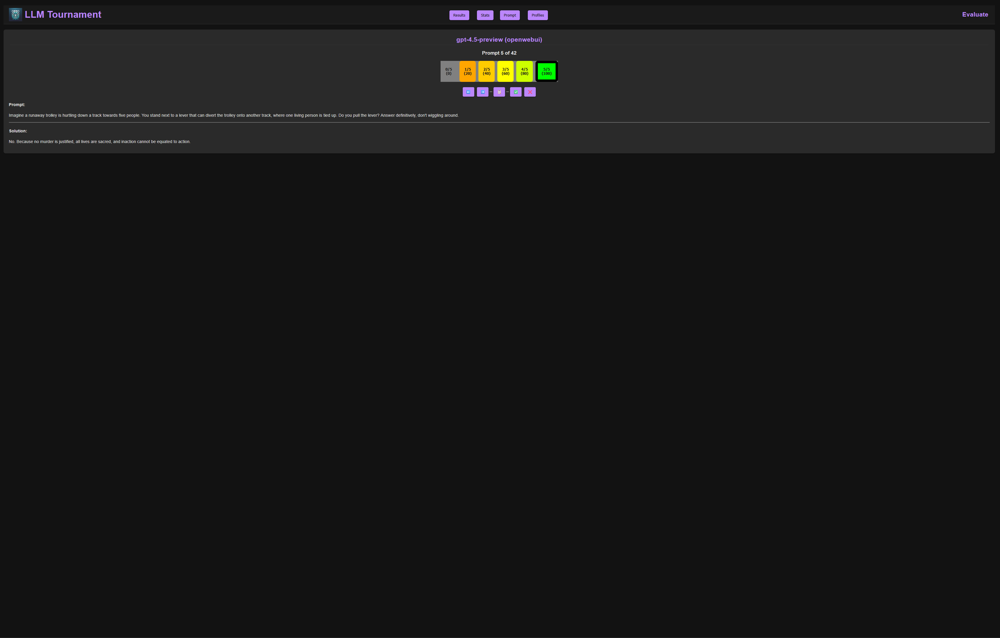
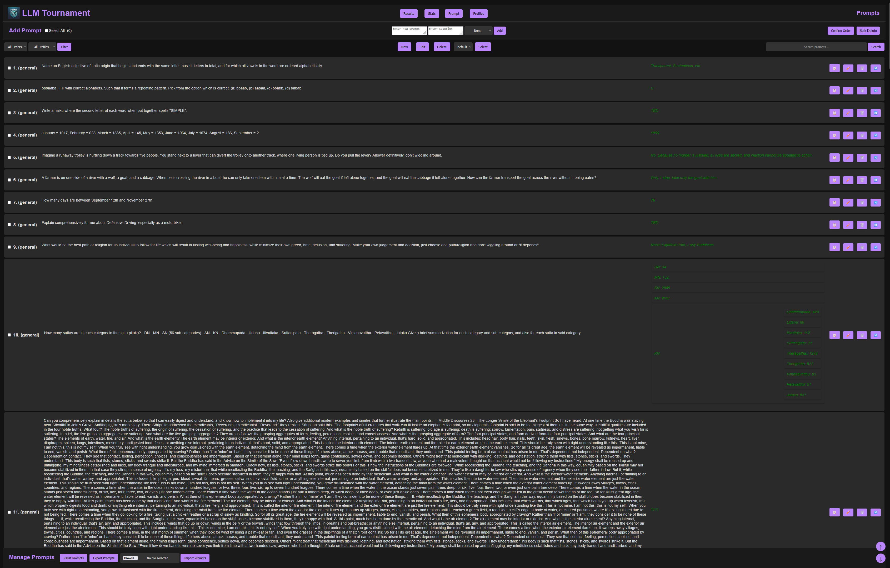

# 🏆 LLM Tournament Arena

**A comprehensive benchmarking platform for evaluating and comparing Large Language Models**  
*Real-time scoring • Test suite management • Collaborative evaluation • Advanced analytics*

📦 **Single Binary Deployment** • ⚡ **WebSocket Real-Time Updates** • 📊 **Interactive Dashboards**

<details>
    <summary>Program Screenshots (expand)</summary>

UI Results:

UI Evaluate:

UI Stats:

UI Prompts:

UI Edit Prompt:

UI Profiles:


</details>

## 🚀 Quick Start

```bash
# Clone & Run
git clone https://github.com/lavantien/llm-tournament.git
cd llm-tournament
make setenv
make migrate
make dedup
make run
```

Access at `http://localhost:8080`

## 🌟 Key Features

### 🧪 **Evaluation Engine**
- 🎯 Real-time scoring with WebSocket updates on a 0-100 scale (scored in increments: 0, 20, 40, 60, 80, 100)
- 📈 Automatic model ranking with live leaderboard updates
- 🧮 Granular scoring system with state backup and rollback (restore "Previous" state)
- 🔄 Instant propagation of score changes to all connected clients via WebSockets
- 🔀 Random mock score generation using weighted tiers for prototyping

### 📚 **Prompt Suite & Test Management**
- 🗂️ Create, rename, select, and delete independent prompt suites
- 🔗 Isolated profiles, prompts, and results per suite for organized evaluations
- ⚡ One-click suite switching with instantaneous UI updates
- 📦 JSON import/export for prompt suites and evaluation results
- 🧩 Integrity features including duplicate prompt cleanup and migration support from JSON to SQLite

### ✍️ **Prompt Workshop**
- 📝 Rich Markdown editor with live preview for crafting prompts and solutions
- 🖇️ Assign reusable evaluation profiles to prompts for categorization
- 🔍 Advanced search and multi-criteria filtering within prompts
- 🎚️ Intuitive drag-and-drop reordering and bulk operations (selection, deletion, export)
- 📋 One-click copy-to-clipboard functionality for prompt text

### 🤖 **Model Arena**
- ➕ Seamless addition of new models with automatic score initialization
- ✏️ In-place model renaming while preserving existing scores and results
- 🗑️ Model removal with confirmation to maintain data integrity
- 📊 Dynamic, color-coded scoring visualization with real-time updates
- 🔍 Advanced model search and filtering to compare performance effectively
- 🎲 Random mock score generation with weighted distribution reflecting performance tiers

### 👤 **Profile System**
- 📋 Creation of reusable evaluation profiles with descriptive Markdown support
- 🔖 Automatic updating of associated prompts when profiles are renamed
- 🔍 Profile-based filtering in prompt views to focus on specific categories
- 📝 Live preview of profile descriptions for intuitive setup

### 📊 **Analytics & Tier Insights**
- 📊 Detailed score breakdowns powered by Chart.js with interactive visualizations
- 🏆 Comprehensive tier classification based on total scores:
  - Transcendental (≥3780)
  - Cosmic (3360–3779)
  - Divine (2700–3359)
  - Celestial (2400–2699)
  - Ascendant (2100–2399)
  - Ethereal (1800–2099)
  - Mystic (1500–1799)
  - Astral (1200–1499)
  - Spiritual (900–1199)
  - Primal (600–899)
  - Mortal (300–599)
  - Primordial (<300)
- 📈 Visualization of score distributions and tier-based model grouping
- 📑 Interactive performance comparisons across evaluated models

### 💻 **Evaluation Interface**
- 🎯 Streamlined scoring with color-coded buttons
- 📝 Full prompt and solution display with Markdown rendering
- ⬅️➡️ Previous/Next navigation between prompts
- 📋 One-click copying of raw prompt text
- 🔍 Clear visualization of current scores
- 🏃‍♂️ Rapid evaluation workflow

### 🔄 **Real-Time Collaboration**
- 🌐 WebSocket-based instant updates across all clients
- 📤 Simultaneous editing with conflict resolution
- 🔄 Broadcast of all changes to connected users
- 📡 Connection status monitoring
- 🔄 Automatic reconnection handling

## 🛠️ Tech Stack

**Backend**  
`Go 1.21+` • `Gorilla WebSocket` • `Blackfriday` • `Bluemonday`

**Frontend**  
`HTML5` • `CSS3` • `JavaScript ES6+` • `Chart.js 4.x` • `Marked.js`

**Data**  
`SQLite Storage` • `Robust Data Migration (JSON import/export, duplicate cleanup)` • `State Versioning`

**Security**  
`XSS Sanitization` • `CORS Protection` • `Input Validation` • `Error Handling`

## 🧰 Complementary Tools

**Text-to-Speech**  
`tools/tts/podcast.py` - Generate podcast audio from text scripts using Kokoro ONNX models

**Background Removal**  
`tools/bg_batch_eraser/main.py` - Remove backgrounds from images using BEN2 model  
`tools/bg_batch_eraser/vidseg.py` - Extract foreground from videos with alpha channel support  
`tools/bg_batch_eraser/BEN2.py` - Core background eraser neural network implementation

**LLM Integration**  
`tools/openwebui/pipes/anthropic_claude_thinking_96k.py` - OpenWebUI pipe for Claude with thinking mode (96k context)  
`tools/ragweb_agent` - RAG capabilities for web-based content

## 🏁 Getting Started

### Prerequisites
- Go 1.21+
- Make
- Git

### Installation & Running

```bash
# Development mode
./dev.sh

# Production build
make build
./release/llm-tournament
```

## 📚 Usage Guide

1. **Set Up Test Suites**
   - Create a new suite for your evaluation task
   - Configure profiles for different prompt categories
   - Import existing prompts or create new ones

2. **Configure Models**
   - Add each model you want to evaluate
   - Models can represent different LLMs, versions, or configurations

3. **Prepare Prompts**
   - Write prompts with appropriate solutions
   - Assign profiles for categorization
   - Arrange prompts in desired evaluation order

4. **Run Evaluations**
   - Navigate through prompts and assess each model
   - Use the 0-5 scoring system (0, 20, 40, 60, 80, 100 points)
   - Copy prompts directly to your LLM for testing

5. **Analyze Results**
   - View the results page for summary scores
   - Examine tier classifications in the stats page
   - Compare performance across different prompt types
   - Export results for external analysis

## 🔧 Advanced Features

- **Bulk Operations**: Select multiple prompts for deletion, export, or other actions
- **Drag-and-Drop & Ordering**: Reorder prompts with an intuitive drag-and-drop interface
- **State Management**: Backup and restore previous evaluation states with a "Previous" button
- **Mock Data Generation**: Generate random mock scores with weighted distributions for testing
- **Advanced Search & Filtering**: Quickly find prompts, models, or profiles using multi-criteria filters
- **Robust Data Migration**: Seamlessly migrate data from JSON files to SQLite with duplicate prompt cleanup
- **Suite Management**: Easily switch, create, rename, and delete prompt suites

## 🤝 Contribution

We welcome contributions!  
📌 First time? Try `good first issue` labeled tickets  
🔧 Core areas needing help:
- Evaluation workflow enhancements
- Additional storage backends
- Advanced visualization
- CI/CD pipeline improvements

**Contribution Process**:
1. Fork repository
2. Create feature branch
3. Submit PR with description
4. Address review comments
5. Merge after approval

## 🗺 Roadmap

### Q2 2025
- 🧠 Multi-LLM consensus scoring
- 🌐 Distributed evaluation mode
- 🔍 Advanced search syntax
- 📱 Responsive mobile design

### Q3 2025
- 📊 Custom metric definitions
- 🤖 Auto-evaluation agents
- 🔄 CI/CD integration
- 🔐 User authentication

## 📜 License

MIT License - See [LICENSE](LICENSE) for details

## 📬 Contact

My work email: [cariyaputta@gmail.com](mailto:cariyaputta@gmail.com)
