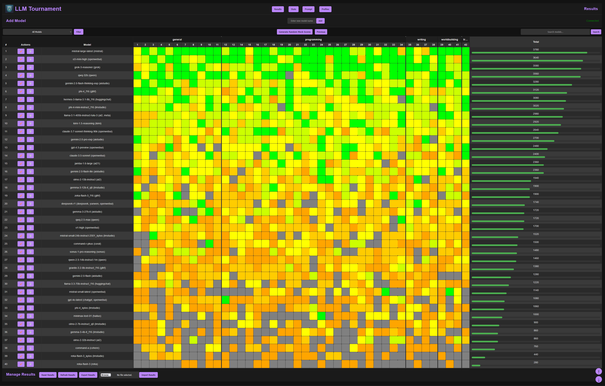
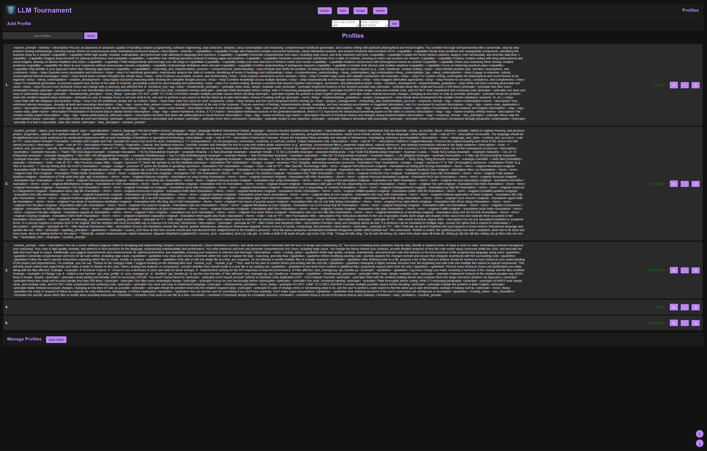

# 🏆 LLM Tournament Arena

**A comprehensive benchmarking platform for evaluating and comparing Large Language Models**  
*Real-time scoring • Test suite management • Collaborative evaluation • Advanced analytics*

📦 **Single Binary Deployment** • ⚡ **WebSocket Real-Time Updates** • 📊 **Interactive Dashboards**

<details>
    <summary>Program Screenshots (expand)</summary>

UI Results:

UI Evaluate:

UI Stats:

UI Prompts:

UI Edit Prompt:

UI Profiles:


</details>

## 🚀 Quick Start

```bash
# Clone & Run
git clone https://github.com/lavantien/llm-tournament.git
cd llm-tournament
make setenv
make migrate
make dedup
make run
```

Access at `http://localhost:8080`

## 🌟 Key Features

### 🧪 **Evaluation Engine**
- 🎯 Real-time scoring with WebSocket updates on a 0-100 scale (scored in increments: 0, 20, 40, 60, 80, 100)
- 📈 Automatic model ranking with live leaderboard updates
- 🧮 Granular scoring system with state backup and rollback (restore "Previous" state)
- 🔄 Instant propagation of score changes to all connected clients via WebSockets
- 🔀 Random mock score generation using weighted tiers for prototyping

### 🤖 **Automated LLM Evaluation** ✨ NEW!
- 🧠 **Multi-Judge Consensus Scoring**: 3 AI judges evaluate responses in parallel
  - Claude Opus 4.5 (extended thinking)
  - GPT-5.2 (extended thinking)
  - Gemini 3 Pro (extended thinking)
- ⚖️ **Weighted Consensus Algorithm**: Scores aggregated by judge confidence levels
- 🎭 **Dual Evaluation Modes**:
  - **Objective**: Semantic matching against expected solutions
  - **Creative**: Quality evaluation without predefined answers
- 📊 **Real-Time Progress Tracking**: WebSocket broadcasts for job status, progress, and costs
- 💰 **Cost Management**: Pre-execution estimates, real-time tracking, threshold alerts (~$0.05 per evaluation)
- ⚡ **Async Job Queue**: 3 concurrent workers with job persistence across restarts
- 🔐 **Secure API Key Storage**: AES-256-GCM encrypted credentials
- 🎯 **Flexible Triggers**: Evaluate all, per-model, per-prompt, or auto-evaluate new models
- 📈 **Evaluation History**: Complete audit trail with judge reasoning and confidence scores

### 📚 **Prompt Suite & Test Management**
- 🗂️ Create, rename, select, and delete independent prompt suites
- 🔗 Isolated profiles, prompts, and results per suite for organized evaluations
- ⚡ One-click suite switching with instantaneous UI updates
- 📦 JSON import/export for prompt suites and evaluation results
- 🧩 Integrity features including duplicate prompt cleanup and migration support from JSON to SQLite

### ✍️ **Prompt Workshop**
- 📝 Rich Markdown editor with live preview for crafting prompts and solutions
- 🖇️ Assign reusable evaluation profiles to prompts for categorization
- 🔍 Advanced search and multi-criteria filtering within prompts
- 🎚️ Intuitive drag-and-drop reordering and bulk operations (selection, deletion, export)
- 📋 One-click copy-to-clipboard functionality for prompt text

### 🤖 **Model Arena**
- ➕ Seamless addition of new models with automatic score initialization
- ✏️ In-place model renaming while preserving existing scores and results
- 🗑️ Model removal with confirmation to maintain data integrity
- 📊 Dynamic, color-coded scoring visualization with real-time updates
- 🔍 Advanced model search and filtering to compare performance effectively
- 🎲 Random mock score generation with weighted distribution reflecting performance tiers

### 👤 **Profile System**
- 📋 Creation of reusable evaluation profiles with descriptive Markdown support
- 🔖 Automatic updating of associated prompts when profiles are renamed
- 🔍 Profile-based filtering in prompt views to focus on specific categories
- 📝 Live preview of profile descriptions for intuitive setup

### 📊 **Analytics & Tier Insights**
- 📊 Detailed score breakdowns powered by Chart.js with interactive visualizations
- 🏆 Comprehensive tier classification based on total scores:
  - Transcendental (≥3780)
  - Cosmic (3360–3779)
  - Divine (2700–3359)
  - Celestial (2400–2699)
  - Ascendant (2100–2399)
  - Ethereal (1800–2099)
  - Mystic (1500–1799)
  - Astral (1200–1499)
  - Spiritual (900–1199)
  - Primal (600–899)
  - Mortal (300–599)
  - Primordial (<300)
- 📈 Visualization of score distributions and tier-based model grouping
- 📑 Interactive performance comparisons across evaluated models

### 💻 **Evaluation Interface**
- 🎯 Streamlined scoring with color-coded buttons
- 📝 Full prompt and solution display with Markdown rendering
- ⬅️➡️ Previous/Next navigation between prompts
- 📋 One-click copying of raw prompt text
- 🔍 Clear visualization of current scores
- 🏃‍♂️ Rapid evaluation workflow

### 🔄 **Real-Time Collaboration**
- 🌐 WebSocket-based instant updates across all clients
- 📤 Simultaneous editing with conflict resolution
- 🔄 Broadcast of all changes to connected users
- 📡 Connection status monitoring
- 🔄 Automatic reconnection handling

## 🛠️ Tech Stack

**Backend**
`Go 1.21+` • `Gorilla WebSocket` • `Blackfriday` • `Bluemonday` • `SQLite` • `AES-256-GCM Encryption`

**AI Evaluation Service**
`Python 3.8+` • `FastAPI` • `LiteLLM` • `Anthropic SDK` • `OpenAI SDK` • `Google Generative AI`

**Frontend**
`HTML5` • `CSS3` • `JavaScript ES6+` • `Chart.js 4.x` • `Marked.js`

**Data**
`SQLite Storage` • `Robust Data Migration (JSON import/export, duplicate cleanup)` • `State Versioning` • `Encrypted Settings`

**Security**
`XSS Sanitization` • `CORS Protection` • `Input Validation` • `Error Handling` • `Encrypted API Keys`

## 🧰 Complementary Tools

**Text-to-Speech**  
`tools/tts/podcast.py` - Generate podcast audio from text scripts using Kokoro ONNX models

**Background Removal**  
`tools/bg_batch_eraser/main.py` - Remove backgrounds from images using BEN2 model  
`tools/bg_batch_eraser/vidseg.py` - Extract foreground from videos with alpha channel support  
`tools/bg_batch_eraser/BEN2.py` - Core background eraser neural network implementation

**LLM Integration**  
`tools/openwebui/pipes/anthropic_claude_thinking_96k.py` - OpenWebUI pipe for Claude with thinking mode (96k context)  
`tools/ragweb_agent` - RAG capabilities for web-based content

## 🏁 Getting Started

### Prerequisites
- Go 1.24+
- Python 3.8+ (for automated evaluation)
- Make
- Git
- SQLite
- GCC

### Installation & Running

#### Manual Evaluation (Traditional)
```bash
# Development mode
./dev.sh

# Setup
make setenv
make migrate
make dedup
make run

# Production build
make build
./release/llm-tournament
```

#### Automated Evaluation (NEW!)
```bash
# 1. Install Python dependencies
cd python_service
pip install -r requirements.txt

# 2. Generate and set encryption key
export ENCRYPTION_KEY=$(openssl rand -hex 32)  # Linux/Mac
# OR
set ENCRYPTION_KEY=<generated-key>             # Windows

# 3. Start Python evaluation service
python main.py  # Runs on :8001

# 4. Start Go server (in new terminal)
cd ..
CGO_ENABLED=1 go run main.go  # Runs on :8080

# 5. Configure API keys at http://localhost:8080/settings
```

**📖 Complete Setup Guide**: See [AUTOMATED_EVALUATION_SETUP.md](AUTOMATED_EVALUATION_SETUP.md)

## 📚 Usage Guide

### Manual Evaluation Workflow

1. **Set Up Test Suites**
   - Create a new suite for your evaluation task
   - Configure profiles for different prompt categories
   - Import existing prompts or create new ones

2. **Configure Models**
   - Add each model you want to evaluate
   - Models can represent different LLMs, versions, or configurations

3. **Prepare Prompts**
   - Write prompts with appropriate solutions
   - Set prompt type: `objective` (with expected answer) or `creative` (open-ended)
   - Assign profiles for categorization
   - Arrange prompts in desired evaluation order

4. **Run Evaluations (Manual)**
   - Navigate through prompts and assess each model
   - Use the 0-5 scoring system (0, 20, 40, 60, 80, 100 points)
   - Copy prompts directly to your LLM for testing

5. **Analyze Results**
   - View the results page for summary scores
   - Examine tier classifications in the stats page
   - Compare performance across different prompt types
   - Export results for external analysis

### Automated Evaluation Workflow ✨ NEW!

1. **Configure API Keys**
   - Navigate to `/settings`
   - Enter API keys for Claude, GPT, and Gemini
   - Set cost alert threshold (default: $100)
   - Enable auto-evaluate for new models (optional)

2. **Prepare Prompts**
   - Set prompt type: `objective` or `creative`
   - For objective prompts: Add expected solution for semantic matching
   - For creative prompts: Judges evaluate quality without expected answer

3. **Trigger Automated Evaluation**
   - **Evaluate All**: Click "Evaluate All" button (all models × all prompts)
   - **Per-Model**: Click "Evaluate" on model row (one model × all prompts)
   - **Per-Prompt**: Click "Evaluate" on prompt column (all models × one prompt)
   - **Auto**: Enable auto-evaluate in settings for new models

4. **Monitor Progress**
   - Real-time WebSocket updates show progress
   - View current/total evaluations and running cost
   - Cancel job anytime if needed

5. **Review Results**
   - Consensus scores automatically saved
   - View evaluation history with judge reasoning
   - Check cost tracking per suite
   - Compare judge confidence levels

## 🔧 Advanced Features

### Manual Evaluation
- **Bulk Operations**: Select multiple prompts for deletion, export, or other actions
- **Drag-and-Drop & Ordering**: Reorder prompts with an intuitive drag-and-drop interface
- **State Management**: Backup and restore previous evaluation states with a "Previous" button
- **Mock Data Generation**: Generate random mock scores with weighted distributions for testing
- **Advanced Search & Filtering**: Quickly find prompts, models, or profiles using multi-criteria filters
- **Robust Data Migration**: Seamlessly migrate data from JSON files to SQLite with duplicate prompt cleanup
- **Suite Management**: Easily switch, create, rename, and delete prompt suites

### Automated Evaluation ✨
- **Job Queue Management**: 3 concurrent workers with job persistence
- **Cost Estimation**: Preview costs before running evaluations
- **Re-evaluation**: Re-score existing prompts with confirmation
- **Judge Selection**: Configure which AI judges to use
- **Evaluation History**: Complete audit trail with reasoning and confidence
- **Hybrid Mode**: Support both manual responses and API-based responses
- **Cost Tracking**: Daily budget monitoring with threshold alerts
- **Job Cancellation**: Stop long-running evaluations anytime

## 🤝 Contribution

We welcome contributions!  
📌 First time? Try `good first issue` labeled tickets  
🔧 Core areas needing help:
- Evaluation workflow enhancements
- Additional storage backends
- Advanced visualization
- CI/CD pipeline improvements

**Contribution Process**:
1. Fork repository
2. Create feature branch
3. Submit PR with description
4. Address review comments
5. Merge after approval

## 🗺 Roadmap

### ✅ Completed (v2.2)
- ✅ Multi-LLM consensus scoring (Claude, GPT, Gemini)
- ✅ Automated evaluation with async job queue
- ✅ Cost tracking and management
- ✅ Encrypted API key storage
- ✅ Real-time progress tracking via WebSocket

### Q2 2025
- 🌐 Distributed evaluation mode
- 🔍 Advanced search syntax
- 📱 Responsive mobile design
- 🔌 API-based model response fetching

### Q3 2025
- 📊 Custom metric definitions
- 🤖 Custom judge configurations
- 🔄 CI/CD integration
- 🔐 User authentication
- 📄 Evaluation report exports (PDF/HTML)
- 📅 Scheduled evaluations

## 📜 License

MIT License - See [LICENSE](LICENSE) for details

## 📬 Contact

My work email: [cariyaputta@gmail.com](mailto:cariyaputta@gmail.com)
